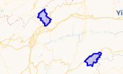

## 三种坐标格式

### WKT

### WKB

### GeoJson

## 合并坐标

### MutiPolygon

```sql
SELECT ST_Union(geom) AS merged_geom
FROM your_table;
```

效果如下：



## 函数

### ST_Transform

```sql
raster ST_Transform(raster rast, integer srid, text algorithm=NearestNeighbor, double precision maxerr=0.125, double precision scalex, double precision scaley);

raster ST_Transform(raster rast, integer srid, double precision scalex, double precision scaley, text algorithm=NearestNeighbor, double precision maxerr=0.125);

raster ST_Transform(raster rast, raster alignto, text algorithm=NearestNeighbor, double precision maxerr=0.125);
```

使用指定的像素扭曲算法将已知空间参考系统中的栅格重新投影到另一个已知空间参考系统。如果未指定算法，则使用‘NearestNeighbor’，如果未指定MAXERR，则使用最大错误百分比0.125。

算法选项有：‘NearestNeighbor’、‘Billinine’、‘Cubic’、‘Cubi Spline’和‘Lanczos’。请参阅： [GDAL扭曲重采样方法 ](http://www.gdal.org/gdalwarp.html)了解更多详细信息。

ST_Transform经常与ST_SetSRID()混淆。ST_Transform实际上将栅格的坐标从一个空间参考系更改为另一个空间参考系(并对像素值进行重采样)，而ST_SetSRID()只是更改了栅格的SRID标识符。

与其他变体不同，变体3需要参考栅格作为 `alignto` 。变换后的栅格将被变换到参考栅格的空间参考系(SRID)，并与参考栅格对齐(ST_SameAlign=TRUE)。
## 应用场景
### 获取中心点
在PostGIS中，获取近似中心点可以通过以下几种方法实现：
* 方法一：使用ST_LineInterpolatePoint
如果有一个线几何体（LineString），可以使用  ST_LineInterpolatePoint  函数来获取线段的中间点。这个函数需要两个参数，第一个是线几何体，第二个是插值比例（0到1之间），0.5代表中间点。
```sql
SELECT ST_AsText(ST_LineInterpolatePoint(ST_LineMerge(geom), 0.5)) FROM your_table;
```
这里  ST_LineMerge  函数将多线（MultiLineString）合并成单线（LineString），  ST_LineInterpolatePoint  则在这条线上找到中间点。
* 方法二：使用ST_Centroid
对于线几何体，还可以使用  ST_Centroid  函数来获取近似中心点。这个函数计算的是几何体的几何质心。
```sql
SELECT ST_AsText(ST_Centroid(geom)) FROM your_table;
```
* 方法三：使用ST_ClosestPoint和ST_Centroid结合
如果想要获取线几何体上的一个近似中间点，可以使用  ST_ClosestPoint  函数结合  ST_Centroid  。
```sql
SELECT ST_AsText(ST_ClosestPoint(geom, ST_Centroid(geom))) FROM your_table;
```
这个查询首先找到线几何体的质心，然后找到质心离线最近的点，这通常是一个近似的中间点。