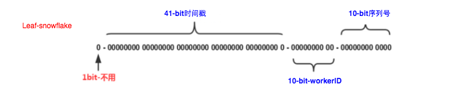

## 前言
### 为什么需要分布式ID
以数据库为例，业务数据量不大时，单库单表完全够用，或者搞个主从同步、读写分离来提高性能。当业务迅速扩张，需要对数据库进行分库分表时，ID生成就不能简单依靠数据库表主键自增了。因为这时需要保证数据库表ID全局唯一。
### 分布式ID实现要求
* 全局唯一：不能出现重复ID；
- 高性能、高可用：生成ID速度快，接近于100%的可用，不会成为业务瓶颈；
- 趋势递增：由于大多数数据库使用B-tree按索引有序存储数据，主键ID递增能保证新增记录时不会发生页分裂，保证写入性能；
- 信息安全：如果ID连续或规则明显，恶意用户或竞争对手爬取信息就非常方便。因此一些场景比如订单，会要求ID不规则。
## 实现
### UUID
[UUID](https://blog.csdn.net/u012397879/article/details/136999310) (Universally Unique IDentifier) 是一个128位数字的全球唯一标识，标准型式包含32个16进制数字，用连字号分为五段，形式为8-4-4-4-12。它生成时用到了网卡地址（即MAC address）、纳秒级时间等。  
以Java语言为例，生成UUID使用`java.util.UUID`即可，使用非常简单。
```java
import java.util.UUID;

public class UniqueId {
  public static void main(String[] args) {
    String uuid = UUID.randomUUID().toString();
    // 结果示例：2e55beed-6a65-47f8-b269-00b518d7da6a
    System.out.println(uuid);
    String uuid2 = uuid.replaceAll("-", "");
    // 结果示例：2e55beed6a6547f8b26900b518d7da6a
    System.out.println(uuid2);
  }
}
```
优点：本地生成，性能非常高，使用简单 缺点：
- 太长不易存储：去掉连字号后的16进制有32字符，太长了，作为表主键应当越短越好；
- 信息不安全：可能会造成MAC地址泄漏；这个漏洞曾被用于寻找“梅丽莎病毒”的作者；
- 无序性：用UUID做表主键，在新增记录时页分裂更加频繁，严重影响写入性能。
### 数据库自增ID
用一个专门的表生成自增ID，提供给其他表使用。以MySQL为例，创建下面的这张表，当需要一个ID时，向表中插入一条记录返回`主键id`即可。
```sql
CREATE TABLE generate_id {
 id BIGINT(20) UNSIGNED NOT NULL AUTO_INCREMENT,
 content CHAR(1) NOT NULL DEFAULT '' COMMENT '无实际意义',
 PRIMARY KEY (id),
} ENGINE=INNODB;
```
**缺点是依赖于数据库服务，存在单点故障，且性能瓶颈明显**。  
解决这个不足，通常有两种方式：`一是使用数据库集群；二是采用号段模式`。
#### 数据库集群模式
以MySQL搭建集群，提高可用性。给各个节点的`auto_increment`设置不同的`起始值`和`自增步长`。假设MySQL集群有3个节点，可以做下面的设置，这样每个节点都能生成唯一ID。
- 节点1生成的ID：1、4、7、10......
- 节点2生成的ID：2、5、8、11......
- 节点3生成的ID：3、6、9、12......
```sql
-- 对节点1
SET @auto_increment_offset = 1; -- 起始值
SET @auto_increment_increment =3; -- 步长

-- 对节点2
SET @auto_increment_offset = 2;
SET @auto_increment_increment =3;

-- 对节点3
SET @auto_increment_offset = 3;
SET @auto_increment_increment =3;
```
#### 号段模式
号段模式下，一次请求将从数据库获取一批自增ID，减小访库次数，降低数据库读写压力。
```sql
CREATE TABLE `segment_id` (
  `biz_tag` VARCHAR(32) NOT NULL DEFAULT '' COMMENT '业务类型',
  `max_id` BIGINT(20) NOT NULL DEFAULT '1' COMMENT '当前最大id',
  `step` INT(11) NOT NULL COMMENT '号段步长',
  `version` INT(20) NOT NULL COMMENT '版本号',
  `update_time` TIMESTAMP NOT NULL DEFAULT CURRENT_TIMESTAMP ON UPDATE CURRENT_TIMESTAMP,
  PRIMARY KEY (`biz_tag`)
) ENGINE=INNODB DEFAULT CHARSET=utf8;
```
比如使用下面的SQL，当需要ID时，先发起查询，然后更新max_id，更新成功则表示获取到新号段`[max_id, max_id+step)`。
```sql
UPDATE segment_id 
SET max_id=max_id+step, VERSION = VERSION + 1 
WHERE VERSION = #{version} and biz_tag = #{biz_tag};
```
### 基于Redis生成ID
利用Redis的 `incr`命令，实现ID的原子性自增。需注意Redis持久化对可靠性的影响。
- RDB持久化方式：定时保存当前数据快照，假如ID自增但Redis没及时持久化就挂掉了，重启Redis后会出现ID重复；
- AOF持久化方式：会对每条写命令进行持久化，即使`Redis`挂掉了也不会出现ID重复的情况，但是Redis重启恢复数据时间较长。
```java
import org.springframework.data.redis.core.StringRedisTemplate;

public class RedisIdWorker {
  private StringRedisTemplate stringRedisTemplate;

  public RedisIdWorker(StringRedisTemplate stringRedisTemplate) {
    this.stringRedisTemplate = stringRedisTemplate;
  }

  public long nextId(String bizTag) {
    return stringRedisTemplate.opsForValue().increment("id:" + bizTag);
  }
}
```
此外，还可以给ID加上毫秒级时间戳前缀，即使使用RDB持久化，Redis故障时也不会出现ID重复。下面是不考虑[时钟回拨](https://blog.csdn.net/xycxycooo/article/details/141307961)时的一个实现。
```java
import org.springframework.data.redis.core.StringRedisTemplate;
import org.springframework.stereotype.Component;

import java.time.LocalDateTime;
import java.time.ZoneOffset;
import java.time.format.DateTimeFormatter;

public class RedisIdWorker {
  // 开始时间戳
  private static final long BEGIN_TIMESTAMP = 1705221450434L;
  // id位数
  private static final int COUNT_BITS = 24;

  private StringRedisTemplate stringRedisTemplate;

  public RedisIdWorker(StringRedisTemplate stringRedisTemplate) {
    this.stringRedisTemplate = stringRedisTemplate;
  }

  public long nextId(String bizTag) {
    // 生成时间戳
    LocalDateTime now = LocalDateTime.now();
    long nowSecond = now.toEpochSecond(ZoneOffset.UTC);
    long timestamp = nowSecond - BEGIN_TIMESTAMP;

    // 2.2.自增长
    long count = stringRedisTemplate.opsForValue().increment("id:" + bizTag);
    return timestamp << COUNT_BITS | count;
  }
}
```
### 雪花算法
[雪花算法](https://blog.csdn.net/weixin_35586546/article/details/116403429)（SnowFlake）是Twitter公司采用并开源的一种算法，能在分布式系统中产生全局唯一且趋势递增的ID。其核心思想是将==64位的long型==ID分为四个部分，分别为：符号位、时间戳、工作机器ID、序列号。


> 第一部分：占用1bit，其值始终是0，没有实际作用；
> 第二部分：时间戳，占用41bit，精确到毫秒，总共可以容纳约69年的时间；
> 第三部分：工作机器id，占用10bit；可以分配高位几个bit表示数据中心ID，剩余bit表示机器节点ID，最多可以容纳1024个节点；
> 第四部分：序列号，占用12bit，每个节点每毫秒从0开始累加，最大到4095。

优点：
* 高效性：生成的ID是一个64位的长整型，相比于UUID的128位，长度更短，减少了存储和传输的成本。同时，雪花算法基于位运算和位移操作，生成ID的过程效率高，理论上snowflake方案的**QPS约为409.6w/s**。
* 有序性：利用时间戳和序列号的组合，雪花算法生成的ID在时间上可以保持递增的顺序，方便排序和查询。
* 可扩展性：雪花算法易于扩展，可以方便地添加或删除节点，适应数据量的变化。
* 容错性高：即使部分节点发生故障，整个系统仍可正常运行。
* 负载均衡：数据在节点间分布均匀，有效利用系统资源。支持随机访问和顺序访问等访问模式。
缺点：强依赖于机器时钟，如果发生时钟回拨，将导致发号重复或服务不可用。
#### 美团Leaf组件
