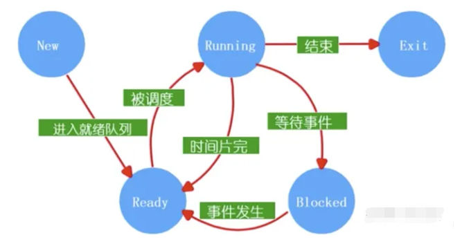
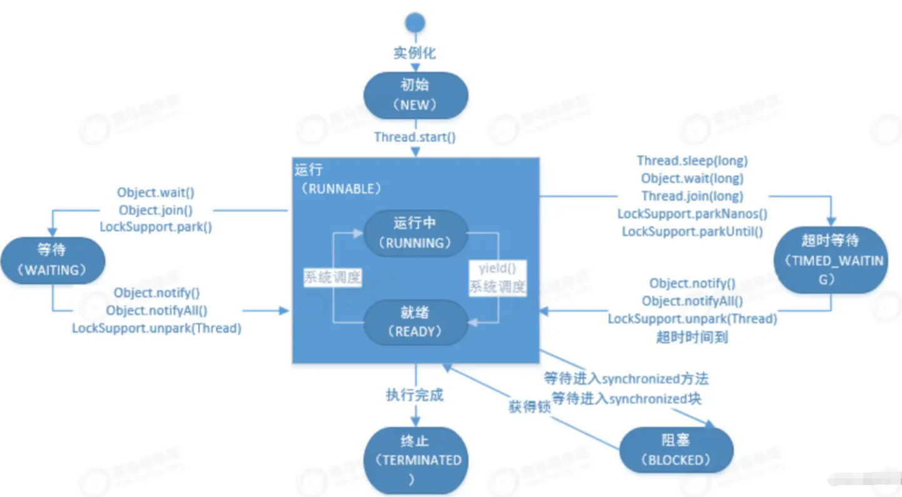

## 进程与线程

### 进程

1. 进程就是运行中的程序

2. 一个进程至少包含一个线程

3. 每一个进程都有属于自己的存储空间和系统资源

4. **进程是系统资源分配的基本单位**

5. 生命周期

   

2. 同一个进程里的多个线程共用进程资源

3. **程是操作系统调度执行的基本单位**

4. java多线程

   1. java进程就是jvm进程，默认有两个线程：main线程和GC线程

   2. 生命周期

      U时间片的权力（CPU时间片就是执行权）。当一个线程抢夺到CPU时间片之后，就开始执行run方法，run方法的开始执行标志着线程进入运行状态。
      2. **运行状态**：run方法的开始执行标志着这个线程进入运行状态，当之前占有的CPU时间片用完之后，会重新回到就绪状态继续抢夺CPU时间片，当再次抢到CPU时间之后，会重新进入run方法接着上一次的代码继续往下执行。
      3. **阻塞状态**：当一个线程遇到阻塞事件，例如接收用户键盘输入，或者sleep方法等，此时线程会进入阻塞状态，阻塞状态的线程会放弃之前占有的CPU时间片。之前的时间片没了需要再次回到就绪状态抢夺CPU时间片。
      4. **锁池**：在这里找共享对象的对象锁线程进入锁池找共享对象的对象锁的时候，会释放之前占有CPU时间片，有可能找到了，有可能没找到，没找到则在锁池中等待，如果找到了会进入就绪状态继续抢夺CPU时间片。（这个进入锁池，可以理解为一种阻塞状态）

   3. 空间分配
	

 !个进程至少有一个线程，线程是进程的一部分，所以线程也被称为轻权进程或者轻量级进程。
- **资源开销：**每个进程都有独立的地址空间，进程之间的切换会有较大的开销；线程可以看做轻量级的进程，同一个进程内的线程共享进程的地址空间，每个线程都有自己独立的运行栈和程序计数器，线程之间切换的开销小。
- **影响关系：**一个进程崩溃后，在保护模式下其他进程不会被影响，但是一个线程崩溃可能导致整个进程被操作系统杀掉，所以多进程要比多线程健壮。

## 并行与并发

* 并发：针对单核 CPU 提出，就是通过一种算法将 CPU 资源合理地分配给多个任务，当一个任务执行 I/O 操作时，CPU 可以转而执行其它的任务，等到 I/O 操作完成以后，或者新的任务遇到 I/O 操作时，CPU 再回到原来的任务继续执行，这个过程会进行上下文切换。

* 并行：针对多核 CPU 提出，多核 CPU 的每个核心都可以独立地执行一个任务，而且多个核心之间不会相互干扰。在不同核心上执行的多个任务，是真正地同时运行，这种状态就叫做并行。

## 多线程基本使用

### 线程创建方式

* 通过Thread类直接创建线程
  1. 继承Thread类（任务与线程合并在一起）
  2. 实现Runnable接口（任务与线程分离）
  3. 实现Callable接口（利用FutureTask执行任务）
* 通过线程池内部创建线程

#### 继承Thread类

```java
//直接继承
@Slf4j
class T extends Thread {
    @Override
    public void run() {
        log.info("我是继承Thread的任务");
    }
}
new T().start();
//使用匿名内部类
new Thread() {
    @Override
    public void run() {
        log.info("我是匿名内部类实现Thread的任务");
    }
}.start();
```

#### 实现Runnable接口

```java
//直接实现
@Slf4j
class R implements Runnable {
    @Override
    public void run() {
        log.info("我是实现Runnable的任务");
    }
}
new Thread(new R()).start();
//使用匿名内部类
new Thread(new Runnable() {
    @Override
    public void run() {
        log.info("我是匿名内部类实现Runnable的任务");
    }
}).start();
//直接使用lambda表达式
new Thread(()->{log.info("我是lambda实现Runnable的任务");}).start();
```

#### 实现Callable接口

```java
//直接实现
class C implements Callable<String> {
    @Override
    public String call() throws Exception {
        System.out.println("我是实现Callable的任务");
        return "success";
    }
}
FutureTask<String> task = new FutureTask<>(new C());
new Thread(task).start();
//匿名内部类实现
FutureTask<String> task = new FutureTask<>(new Callable<String>() {
    @Override
    public String call() throws Exception {
        System.out.println("我是实现Callable的任务");
        return "success";
    }
});
new Thread(task).start();
//lambda表达式实现
FutureTask<String> task = new FutureTask<>(() -> {
    System.out.println("我是实现Callable的任务");
    return "success";
});
new Thread(task).start();
```

### Thread线程方法

#### 启动线程start()

通过调用start方法启动一个分支线程，在JVM中开辟一个新的线程空间。线程启动后会自动执行run方法，并且run方法在分支栈的栈底部（压栈）。

#### 执行任务run()

单纯调用run方法并不会启动新线程来执行，此时的执行run方法的线程还是当前线程。

#### 线程礼让yield()

yield()方法会让运行中的线程切换到就绪状态，重新争抢cpu的时间片，争抢时是否获取到时间片看cpu的分配。

#### 线程优先级setPriority(int newPriority)

```java
public final static int MIN_PRIORITY = 1;
public final static int NORM_PRIORITY = 5;
public final static int MAX_PRIORITY = 10;
```

线程内部用1~10的数来调整线程的优先级，默认的线程优先级为NORM_PRIORITY=5

 cpu比较忙时，优先级高的线程获取更多的时间片，cpu比较闲时，优先级设置基本没用

#### 设置守护线程setDaemon(boolean on)

默认情况下，java进程需要等待所有线程都运行结束，才会结束，有一种特殊线程叫守护线程，当所有的非守护线程都结束后，即使它没有执行完，也会强制结束。

默认的线程都是非守护线程。垃圾回收线程就是典型的守护线程。

#### 线程阻塞

广义上使得线程阻塞的方式有下面几种：

6. IO阻塞，即使用了阻塞式的io流

7. sleep(long time) 让线程休眠进入阻塞状态

8. a.join() 调用该方法的线程进入阻塞，等待a线程执行完恢复运行

9. sychronized或ReentrantLock 造成线程未获得锁进入阻塞状态

10. 获得锁之后调用wait()方法 也会让线程进入阻塞状态

11. LockSupport.park() 让线程进入阻塞状态

##### sleep(long time)

使线程休眠，会将运行中的线程进入阻塞状态。当休眠时间结束后，重新争抢cpu的时间片继续运行。

##### join()

调用该方法的线程会进入阻塞状态，等待被调用的方法执行完后恢复运行。join(int millis)可以设置等待的时间。

#### 线程打断

```java
//相关方法
public void interrupt() {
}
public boolean isInterrupted() {
}
public static boolean interrupted() {
}
```

打断标记：线程是否被打断，true表示被打断了，false表示没有

**isInterrupted()**：获取线程的打断标记 ,调用后不会修改线程的打断标记

**interrupt()**：方法用于中断线程

12. 可以打断sleep,wait,join等显式的抛出InterruptedException方法的线程，但是打断后,线程的打断标记还是false
13. 打断正常线程 ，线程不会真正被中断，但是线程的打断标记为true

**interrupted()**：获取线程的打断标记，调用后清空打断标记 即如果获取为true 调用后打断标记为false (不常用)

```java
@Slf4j
class TwoPhaseTerminal{
    // 监控线程
    private Thread monitor;

    public void start(){
        monitor = new Thread(() ->{
           // 不停的监控
            while (true){
                Thread thread = Thread.currentThread();
             	// 判断当前线程是否被打断
                if (thread.isInterrupted()){
                    log.info("当前线程被打断,结束运行");
                    break;
                }
                try {
                    Thread.sleep(1000);
                	// 监控逻辑中被打断后，打断标记为true
                    log.info("监控");
                } catch (InterruptedException e) {
                    // 睡眠时被打断时抛出异常 在该处捕获到 此时打断标记还是false
                    // 在调用一次中断 使得中断标记为true
                    thread.interrupt();
                }
            }
        });
        monitor.start();
    }

    public void stop(){
        monitor.interrupt();
    }
}
```

#### Thread线程的状态切换

##### Thread类内部枚举State

```java
public enum State {
	NEW,
	RUNNABLE,
	BLOCKED,
	WAITING,
	TIMED_WAITING,
	TERMINATED;
}
```

14. **NEW**：线程对象被创建

15. **Runnable**：线程调用了start()方法后进入该状态，该状态包含了三种情况
   1. 就绪状态：等待cpu分配时间片
   2. 运行状态：进入Runnable方法执行任务
   3. 阻塞状态：执行阻塞式io流时的状态

16. **Blocked**：没获取到锁时的阻塞状态(同步锁章节会细说)

17. **WAITING**：调用wait()、join()等方法后的状态

18. **TIMED_WAITING**：调用 sleep(time)、wait(time)、join(time)等方法后的状态

19. **TERMINATED**：线程执行完成或抛出异常后的状态

##### 六种线程状态和方法的对应关系


**wait()**：使当前线程从调用处中断并且释放锁转入等待队列，直到收到notify或者notifyAll的通知才能从等待队列转入锁池队列，没有收到停止会一直死等。

**wait(long timeout)**：相比wait多了一个等待的时间time，如果经过time(毫秒)时间后没有收到notify或者notifyAll的通知，自动从等待队列转入锁池队列。

**注意点**：wait的两个方法都需要注意中断的问题，wait中断是从语句处中断并且释放锁，当再次获得锁时是从中断处继续向下执行。

#### notify()和notifyAll()

**notify()**：随机从等待队列中通知一个**持有相同锁的一个线程**，如果没有持有相同锁的wait线程那么指令忽略无效。注意是持有相同锁，并且是随机没有固定的，顺序这一点在生产者消费者模型中很重要，会造成假死的状态。

**notifyAll()**：通知等待队列中的**持有相同锁的所有线程**，让这些线程转入锁池队列。如果没有持有相同锁的wait线程那么指令忽略无效。

**注意点**：notify 和 notifyAll方法通知是延迟通知，必须等待当前线程体执行完所有的**同步方法/代码块中的语句**退出释放锁才通知wait线程。

### 线程相关方法总结

| 方法名称                  | 是否static | 方法说明                                                     |
| ------------------------- | ---------- | ------------------------------------------------------------ |
| start()                   | 否         | 让线程启动，进入就绪状态,等待cpu分配时间片                   |
| run()                     | 否         | 重写Runnable接口的方法,线程获取到cpu时间片时执行的具体逻辑   |
| yield()                   | 是         | 线程的礼让，使得获取到cpu时间片的线程进入就绪状态，重新争抢时间片 |
| sleep(time)               | 是         | 线程休眠固定时间，进入阻塞状态，休眠时间完成后重新争抢时间片,休眠可被打断 |
| join()/join(time)         | 否         | 调用线程对象的join方法，调用者线程进入阻塞,等待线程对象执行完或者到达指定时间才恢复，重新争抢时间片 |
| isInterrupted()           | 否         | 获取线程的打断标记，true:被打断，false：没有被打断。调用后不会修改打断标记 |
| interrupt()               | 否         | 打断线程，抛出InterruptedException异常的方法均可被打断，但是打断后不会修改打断标记，正常执行的线程被打断后会修改打断标记 |
| interrupted()             | 否         | 获取线程的打断标记。调用后会清空打断标记                     |
| stop()                    | 否         | 停止线程运行（不推荐），可能会造成数据丢失                   |
| suspend()                 | 否         | 挂起线程 不推荐                                              |
| resume()                  | 否         | 恢复线程运行 不推荐                                          |
| currentThread()           | 是         | 获取当前线程                                                 |
| wait()/wait(long timeout) | 否         | 获取到锁的线程释放锁进入阻塞状态                             |
| notify()                  | 否         | 随机唤醒被wait()的一个线程                                   |
| notifyAll()               | 否         | 唤醒被wait()的所有线程，重新争抢时间片                       |

## 线程池基本使用

### 为什么需要线程池

线程的资源很宝贵，不可能无限的创建。如果需要处理大量任务，频繁地创建和销毁线程会浪费时间和效率，尤其是浪费内存。所以必须要有管理线程的工具，线程池就是一种管理线程的工具，java开发中经常有池化的思想，如 数据库连接池、Redis连接池等。

线程池通过预先创建一定数量的线程，让这些线程处理来自任务队列中的任务，而不是频繁创建和销毁线程。任务执行完成后，线程不会被销毁，而是放回线程池中以供下一次使用，这避免了频繁创建和销毁线程的开销。同时，线程池还可以限制线程的数量，避免线程数量过多导致资源竞争、上下文切换等问题，从而提高程序的执行效率。

### 线程池的优势

20. 降低资源消耗，通过池化思想，减少创建线程和销毁线程的消耗，控制资源
21. 提高响应速度，任务到达时，无需创建线程即可运行
22.  可控制线程的最大并发数 , 提高资源使用效率 , 避免资源竞争导致堵塞

### 合理使用线程池

用线程池构建应用程序时，需要注意线程安全问题，防止出现同步错误、死锁、资源不足或线程泄漏等问题。在使用线程池时，需要考虑设备资源大小来设置线程池参数。

## 常用工具

### CountDownLatch

