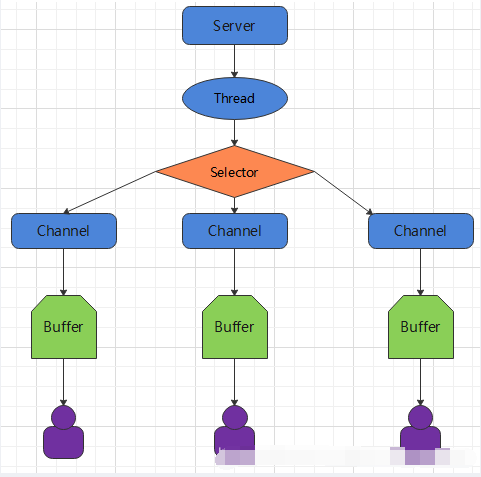
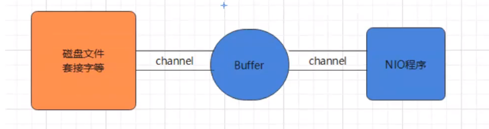
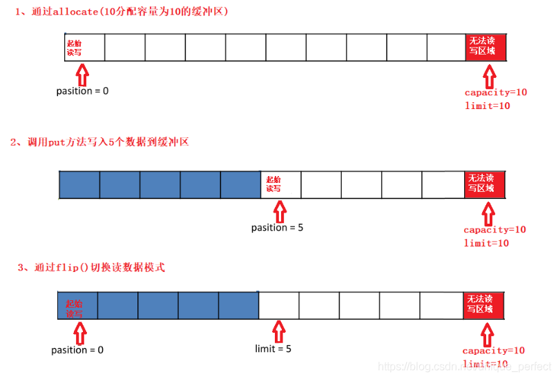
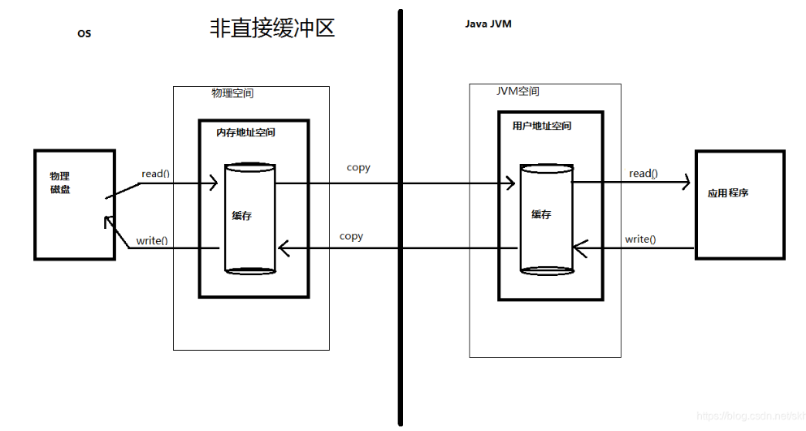
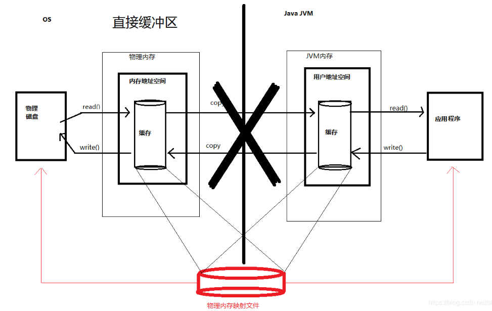

## 简介

**NIO** (New lO)也有人称之为java non-blocking lO是从Java 1.4版本开始引入的一个新的IO API，可以替代标准的Java lO API。NIO与原来的IO有同样的作用和目的，但是使用的方式完全不同，**NIO支持面向缓冲区的、基于通道的IO操作**。NIO将以更加高效的方式进行文件的读写操作。**NIO可以理解为非阻塞IO**，传统的IO的read和write只能阻塞执行，线程在读写IO期间不能干其他事情，比如调用socket.read()时，如果服务器一直没有数据传输过来，线程就一直阻塞，而NIO中可以配置socket为非阻塞模式。

- NIO相关类都被放在java.nio包及子包下，并且对原java.io包中的很多类进行改写。
- NIO有三大核心部分:Channel(通道)，Buffer(缓冲区)， Selector(选择器)
- Java NlO的非阻塞模式，使一个线程从某通道发送请求或者读取数据，但是它仅能得到目前可用的数据，如果目前没有数据可用时，就什么都不会获取，而不是保持线程阻塞，所以直至数据变的可以读取之前，该线程可以继续做其他的事情。非阻塞写也是如此，一个线程请求写入一些数据到某通道，但不需要等待它完全写入，这个线程同时可以去做别的事情。
- 通俗理解:NIO是可以做到用一个线程来处理多个操作的。假设有1000个请求过来，根据实际情况，可以分配20或者80个线程来处理。不像之前的阻塞IO那样，非得分配1000个。

## BIO与NIO比较

- BIO以流的方式处理数据，而NIO以块的方式处理数据，块I/O的效率比流IO高很多
- BIO是阻塞的，NIO则是非阻塞的
- BlO基于字节流和字符流进行操作，而NIO基于Channel(通道)和Buffer(缓冲区)进行操作，数据总是从通道读取到缓冲区中，或者从缓冲区写入到通道中。Selector(选择器)用于监听多个通道的事件（比如:连接请求，数据到达等)，因此使用单个线程就可以监听多个客户端通道

|            NIO            |          BIO          |
| :-----------------------: | :-------------------: |
|   面向缓冲区（Buffer）    |   面向流（Stream）    |
| 非阻塞（Non Blocking IO） | 阻塞IO（Blocking IO） |
|    选择器（Selectors）    |                       |

**NIO**可以先将数据写入到缓冲区，然后再有缓冲区写入通道，因此可以做到**同步非阻塞**。

**BIO**则是面向的流，读写数据都是单向的。因此是同步阻塞。

## NIO核心原理

NIO有三大核心部分: **Channel(通道)，Buffer(缓冲区)，Selector(选择器)**

* **Buffer(缓冲区)**：缓冲区本质上是一块可以写入数据，然后可以从中读取数据的内存。这块内存被包装成NIO Buffer对象，并提供了一组方法，用来方便的访问该块内存。相比较直接对数组的操作，Buffer APl更加容易操作和管理。

* **Channel(通道)**：Java NIO的通道类似流，但又有些不同:既可以从通道中读取数据，又可以写数据到通道。但流的(input或output)读写通常是单向的。通道可以非阻塞读取和写入通道，通道可以支持读取或写入缓冲区，也支持异步地读写。

* **Selector(选择器)**：Selector是一个Java NIO组件，可以能够检查一个或多个NIO通道，并确定哪些通道已经准备好进行读取或写入。这样，一个单独的线程可以管理多个channel，从而管理多个网络连接，提高效率



- 每个channel都会对应一个 Buffer
- 一个线程对应Selector，一个Selector对应多个channel(连接)程序
- 切换到哪个channel是由事件(Event)决定的
- Selector会根据不同的事件，在各个通道上切换
- Buffer就是一个内存块，底层是一个数组
- 数据的读取写入是通过 Buffer完成的，BlO中要么是输入流，或者是输出流，不能双向，但是NIO的Buffer是可以读也可以写。
- Java NIO系统的核心在于：通道(Channel)和缓冲区(Buffer)。通道表示打开到lO设备(例如:文件、套接字)的连接。若需要使用NIO系统，需要获取用于连接IO设备的通道以及用于容纳数据的缓冲区。然后操作缓冲区，对数据进行处理。简而言之，Channel负责传输，Buffer负责存取数据

## Buffer缓存区

**缓冲区(Buffer)**：一个用于特定基本数据类型的容器。定义在java.nio包下，所有缓冲区都是Buffer抽象类的子类。Java NIO中的 **Buffer主要用于与NIO通道进行交互**，**数据是从通道读入缓冲区，从缓冲区写入通道**中的。



### **Buffer类及其子类**

Buffer就像一个数组，可以保存多个相同类型的数据。根据数据类型不同 ，有以下Buffer常用子类：  

- ByteBuffer 
- CharBuffer 
- ShortBuffer 
- IntBuffer 
- LongBuffer 
- FloatBuffer 
- DoubleBuffer 

这些Buffer类都采用相似的方法进行管理数据，只是各自管理的数据类型不同。

都是通过如下方法获取一个Buffer对象：

**public static XxxBuffer allocate(int capacity)**：创建一个容量为capacity 的 XxxBuffer 对象

### 重要概念

1. **容量(capacity)**：作为一个内存块，Buffer具有一定的固定大小，也称为“容量”，缓冲区容量不能为负，且创建后不能更改。
2. **限制(limit)**：表示缓冲区中可以操作数据的大小（**limit**位置后数据不能进行读写）。缓冲区的**limit**不能为负，并且不能大于其**capacity**。 写入模式，**limit**等于Buffer的**capacity**。读取模式下，limit等于写入的数据量。
3. **位置(position)**：下一个要读取或写入的数据的索引。 缓冲区的**position**不能为负，并且不能大于**limit**。
4. **标记(mark)与重置(reset)**：标记是一个索引，通过调用**mark()**方法指定Buffer中一个特定的**position**，之后可以通过调用**reset()**方法恢复到这个**position**.

上述标记、位置、限制、容量遵守规则：**0 ≤ mark ≤ position ≤ limit ≤ capacity**



### 常用方法

**Buffer常见方法**

1. **Buffer clear()**：清空缓冲区并返回对缓冲区的引用。
2. **Buffer flip()**：将缓冲区的界限设置为当前位置， 并将当前位置重置为0。
3. **int capacity()**：返回 Buffer的**capacity**大小。
4. **boolean hasRemaining()**：判断缓冲区中是否还有元素。
5. **int limit()**：返回Buffer的界限**limit**的位置。
6. **Buffer limit(int n)**：将设置缓冲区**limit**为n, 并返回**limit**修改后的缓冲区对象，会将大于旧**limit**的**mark**和**position**重置为-1和修改为新**limit**。
7. **Buffer mark()**：对缓冲区设置标记。
8. **int position()**：返回缓冲区的当前位置**position**。
9. **Buffer position(int n)**：将设置缓冲区的当前位置为n， 并返回修改后的Buffer对象，会将大于旧**position**的**mark**重置为-1。
10. **int remaining()**：返回**position**和**limit**之间的元素个数。
11. **Buffer reset()**：将位置**position**转到以前设置的**mark**所在的位置。
12. **Buffer rewind()**：将位置设为为0，取消设置的**mark**。

**数据操作方法**

1. **get()**：读取单个字节。
2. **get(byte[] dst)**：批量读取多个字节到**dst**中。
3. **get(int index)**：读取指定索引位置的字节(不会移动**position**)放到入数据到Buffer中。
4. **put(byte b)**：将给定单个字节写入缓冲区的当前位置。
5. **put(byte[] src)**：将src中的字节写入缓冲区的当前位置。
6. **put(int index, byte b)**：将指定字节写入缓冲区的索引位置(不会移动**position**)。

**使用Buffer读写数据一般步骤**

1. 写入数据到Buffer。
2. 调用**flip()**方法，转换为读取模式。
3. 从Buffer中读取数据。
4. 调用**clear()**方法或者**compact()**方法清除缓冲区。

### Buffer内存分类

Java NIO提供了基于JVM堆内存和基于直接内存的两类Buffer。

根据实现方式分为三种不同的Buffer：HeapByteBuffer、DirectByteBuffer、MappedByteBuffer。

- HeapByteBuffer是在jvm堆上申请的内存，而DirectByteBuffer、MappedByteBuffer是在堆外申请的内存。
- MappedByteBuffer借助了mmap（内存映射文件），提高了文件读取效率。

直接内存与推内存区别：

对**直接内存来说，JVM将会在IO操作上具有更高的性能，因为它直接作用于本地系统的IO操作**。而**非直接内存，也就是堆内存中的数据，如果要做IO操作，会先从本进程内存复制到直接内存**，再利用本地IO处理。

从数据流的角度，非直接内存的作用链：**本地IO-->直接内存-->非直接内存-->直接内存-->本地IO**；而直接内存是：**本地IO-->直接内存-->本地IO**。

很明显，在做IO处理时，**比如网络发送大量数据时，直接内存会具有更高的效率**。

直**接内存使用allocateDirect创建，但是它比申请普通的堆内存需要耗费更高的性能**。不过，**这部分的数据是在JVM之外的，因此它不会占用JVM应用的内存**。

字**节缓冲区是直接缓冲区还是非直接缓冲区可通过调用其isDirect()方法来**确定。





**直接内存优缺点**

优点：

- 不占用堆内存空间，减少了发生GC的可能。
- Java虚拟机实现上，本地IO会直接操作直接内存（直接内存<=`系统调用`=>硬盘/网卡），而非直接内存的读写则需要二次拷贝（堆内存<=>直接内存<=`系统调用`=>硬盘/网卡）。

缺点：

- 初始分配较慢。
- 没有JVM直接帮助管理内存，容易发生内存溢出。

为了避免一直没有FULL GC，最终导致直接内存把物理内存被耗完，我们可以指定直接内存的最大值。

通过`-XX:MaxDirectMemorySize`来指定最大值，当达到阈值的时候，调用System.gc()来进行一次FULL GC， 间接把那些没有被使用的直接内存回收掉。

> **-XX:MaxDirectMemorySize**指定的是方法区之外的直接内存大小。
>
> 如果要指定方法区这块直接内存的大小通过**-XX:MetaspaceSize**来设置。

所以，**有很大的数据需要缓存，并且它的生命周期又很长，那么就比较适合使用直接内存**。只是一般来说，如果不是能带来很明显的性能提升，还是推荐直接使用堆内存。

## Channel通道

通道（Channel）：定义在java.nio.channels包下面的一个接口，表示IO源与目标打开的连接。

```java
public interface Channel extends Closeable{}
```

Channel类似于传统的“流”。只不过Channel本身不能直接访问数据，Channel只能与Buffer进行交互。

NIO的通道类似于流，但是有些区别如下：

* 通道可以同时进行读写，而流只能读或者只能写。
* 通道可以实现异步读写数据。
* 通道可以从缓冲区读数据，也可以写数据到缓冲区。

### 常用的Channel实现类

* **FileChannel**：用于读取、写入、映射和操作文件的通道。
* **DatagramChannel**：通过 UDP 读写网络中的数据通道。
* **SocketChannel**：通过 TCP 读写网络中的数据。
* **ServerSocketChannel**：可以监听新进来的 TCP 连接，对每一个新进来的连接都会创建一个 SocketChannel。 

ps：ServerSocketChannel 类似 ServerSocket , SocketChannel 类似 Socket。

获取通道的一种方式是对支持通道的对象调用getChannel()方法。支持通道的类如下：

* FileInputStream
* FileOutputStream
* RandomAccessFile
* DatagramSocket
* Socket
* ServerSocket

获取通道的其他方式是使用**Files**类的静态方法**newByteChannel()** 获取字节通道，或者通过通道的静态方法**open()**打开并返回指定通道

## Selector选择器
