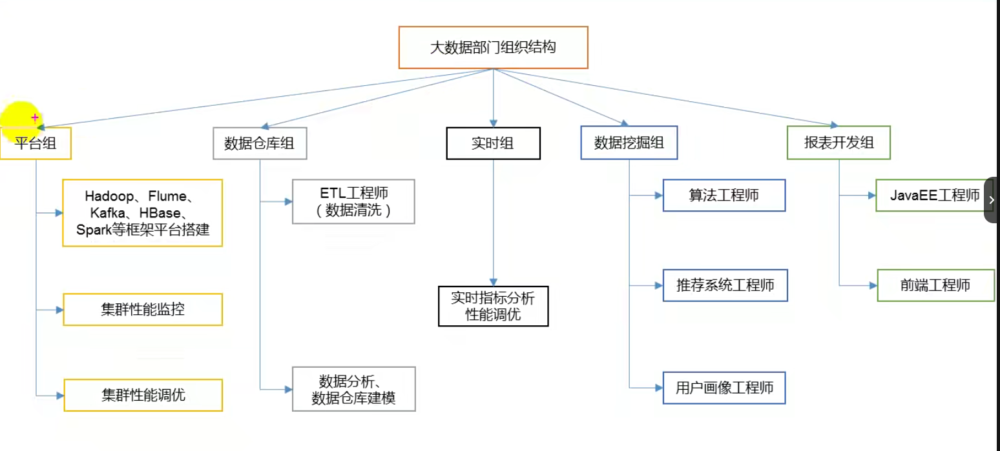
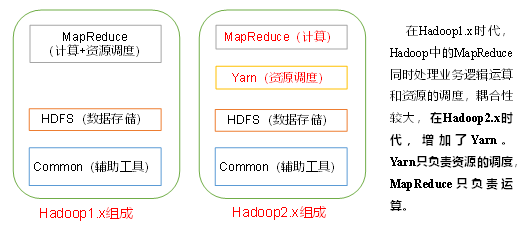
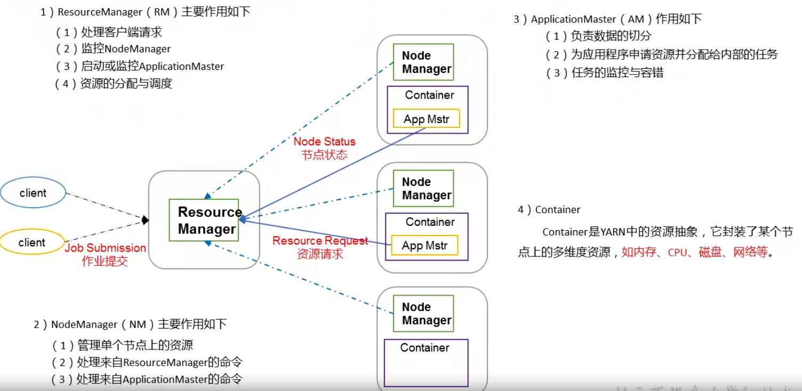
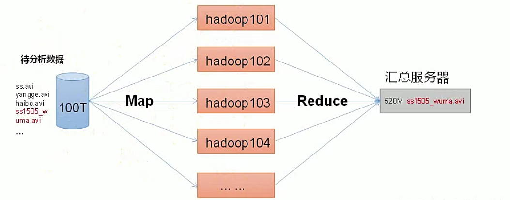
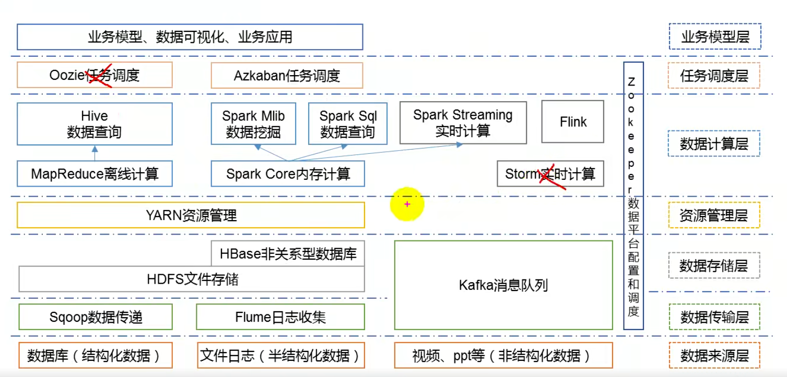
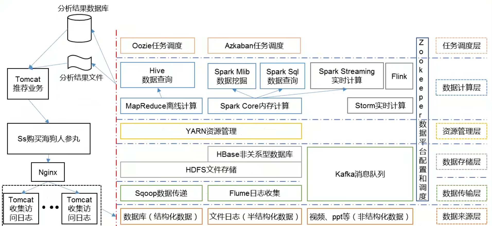

## 大数据概论

大数据：指无法在一段事件范围内用常规软件工具进行捕捉、管理和处理的数据集合，是需要新处理模式才能具有更强的决策力、洞察发现力和流程优化能力的海量，高速增长率和多样化的信息资产。主要解决海量数据的存储和分析计算问题。

按顺序给出数据的存储单位：bit、Byte、KB、MB、GB、TB、PB、EB、ZB、YB、BB、NB、DB。

大数据特点：`Volume（大量）、Velocity（高速增长）、Variety（多样）、Value（低价值密度）`

大数据部门组织结构：

## Hadoop大数据体系

### Hadoop简介

#### Hadoop概念

Hadoop是一个由Apache基金会开发的分布式系统基础架构。主要解决海量数据的存储和海量数据的分析计算问题。广义上来说，Hadoop通常是指一个更广泛的概念——Hadoop生态圈。

#### Hadoop优势

1. 高可用性：Hadoop底层维护多个数据副本，所以及时Hadoop某个计算元素或存储出现故障，也不会导致数据的丢失
2. 高扩展性：在集群间分配任务数据，可方便的扩展数以千计的节点。
3. 高效性：在MapReduce的思想下，Hadoop是并行工作的，以加快任务处理速度。
4. 高容错性：能够自动将失败的任务重新分配。

### Hadoop组成

#### HDFS架构概述

1. NameNode（nn）：存储文件的**元数据**，如文件名，文件目录结构，文件属性（生成事件、副本数、文件权限），以及每个文件的块列表和块所在的DataNode等。
2. DataNode（dn）：在本地文件系统的存储文件块数据，以及块数据的校验和。
3. SecondaryNameNode（2nn）：每隔一段时间对NameNode元数据备份。一般恢复数据的时候才会用到它，它也不能保证完全数据恢复。

#### YARN架构概述

1. ResourceManager（rm）：统筹管理每一台机器上的资源，并且负责接收处理客户端作业请求。
2. NodeManager（nm）：负责单独每一台机器的资源管理，实时保证和ResourceManager通信。
3. ApplicationMaster：针对每个请求job的抽象封装。
4. Container：将来运行在YARN上的每一个任务都会给其分配资源，Container就是当前任务所需资源的抽象封装。

#### MapReduce架构概述

MapReduce将计算过程分为两个阶段：Map和Reduce

1. Map阶段并行处理输入数据。
2. Reduce阶段对Map结果进行汇总。

### 大数据技术生态体系

1）**Sqoop**：Sqoop是一款开源的工具，主要用于在Hadoop、Hive与传统的数据库（MySql）间进行数据的传递，可以将一个关系型数据库（例如 ：MySQL，Oracle 等）中的数据导进到Hadoop的HDFS中，也可以将HDFS的数据导进到关系型数据库中。

2）**Flume**：Flume是一个高可用的，高可靠的，分布式的海量日志采集、聚合和传输的系统，Flume支持在日志系统中定制各类数据发送方，用于收集数据； 

3）**Kafka**：Kafka是一种高吞吐量的分布式发布订阅消息系统； 

4）**Spark**：Spark是当前最流行的开源大数据内存计算框架。可以基于Hadoop上存储的大数据进行计算。

5）**Flink**：Flink是当前最流行的开源大数据内存计算框架。用于实时计算的场景较多。

6）**Oozie**：Oozie是一个管理Hdoop作业（job）的工作流程调度管理系统。

7）**Hbase**：HBase是一个分布式的、面向列的开源数据库。HBase不同于一般的关系数据库，它是一个适合于非结构化数据存储的数据库。

8）**Hive**：Hive是基于Hadoop的一个数据仓库工具，可以将结构化的数据文件映射为一张数据库表，并提供简单的SQL查询功能，可以将SQL语句转换为MapReduce任务进行运行。 其优点是学习成本低，可以通过类SQL语句快速实现简单的MapReduce统计，不必开发专门的MapReduce应用，十分适合数据仓库的统计分析。

9）**ZooKeeper**：它是一个针对大型分布式系统的可靠协调系统，提供的功能包括：配置维护、名字服务、分布式同步、组服务等。

### 推荐系统框架图

## Hadoop运行环境

### Hadoop目录结构

（1）bin目录：存放对Hadoop相关服务（HDFS,YARN）进行操作的脚本

（2）etc目录：Hadoop的配置文件目录，存放Hadoop的配置文件

（3）lib目录：存放Hadoop的本地库（对数据进行压缩解压缩功能）

（4）sbin目录：存放启动或停止Hadoop相关服务的脚本

（5）share目录：存放Hadoop的依赖jar包、文档、和官方案例

### Hadoop运行模式

1. 本地模式：hadoop默认安装后启动就是本地模式，就是将来的数据存在Linux本地，并且运行MR程序的时候也是在本地机器上运行
2. 伪分布式模式：伪分布式其实就只在一台机器上启动HDFS集群，启动YARN集群，并且数据存在HDFS集群上，以及运行MR程序也是在YARN上运行，计算后的结果也是输出到HDFS上。本质上就是利用一台服务器中多个java进程去模拟多个服务
3. 完全分布式：完全分布式其实就是多台机器上分别启动HDFS集群，启动YARN集群，并且数据存在HDFS集群上的以及运行MR程序也是在YARN上运行，计算后的结果也是输出到HDFS上。

### 配置文件说明

Hadoop配置文件分两类：默认配置文件和自定义配置文件，只有用户想修改某一默认配置值时，才需要修改自定义配置文件，更改相应属性值。

1. 默认配置文件

| 要获取的默认文件     | 文件存放在Hadoop的jar包中的位置                             |
| :------------------- | :---------------------------------------------------------- |
| [core-default.xml]   | hadoop-common-3.1.3.jar/  core-default.xml                  |
| [hdfs-default.xml]   | hadoop-hdfs-3.1.3.jar/  hdfs-default.xml                    |
| [yarn-default.xml]   | hadoop-yarn-common-3.1.3.jar/  yarn-default.xml             |
| [mapred-default.xml] | hadoop-mapreduce-client-core-3.1.3.jar/  mapred-default.xml |

2. 自定义配置文件

   **core-site.xml、hdfs-site.xml、yarn-site.xml、mapred-site.xml**四个配置文件存放在$HADOOP_HOME/etc/hadoop这个路径上，用户可以根据项目需求重新进行修改配置。

