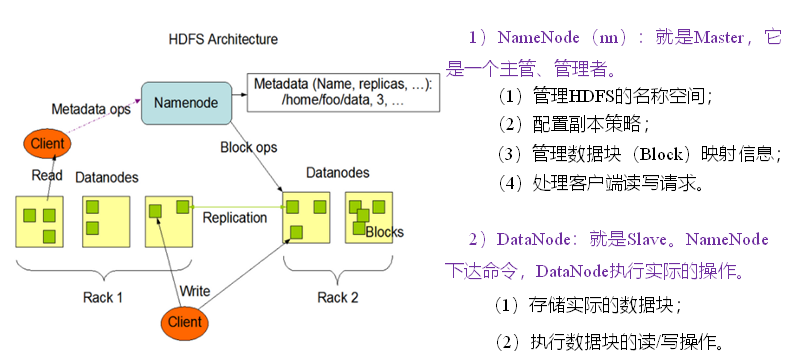
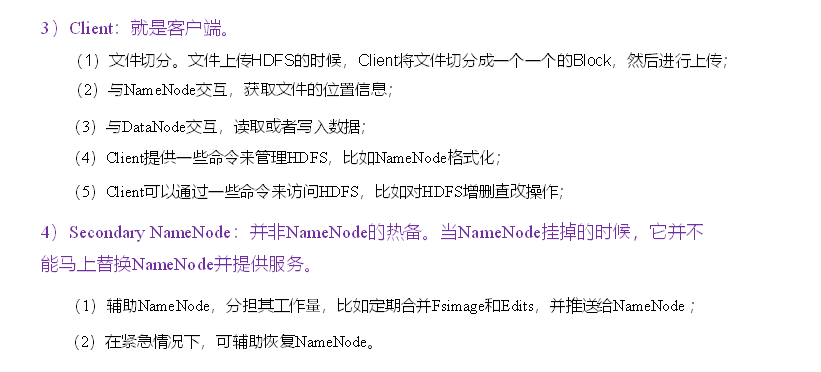
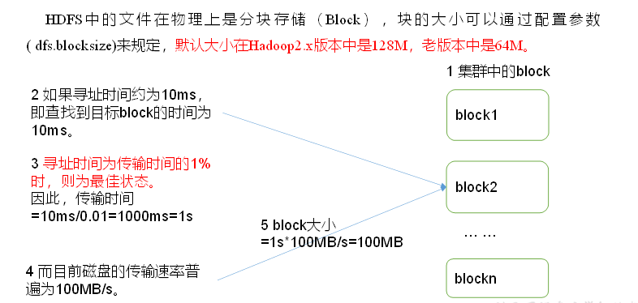
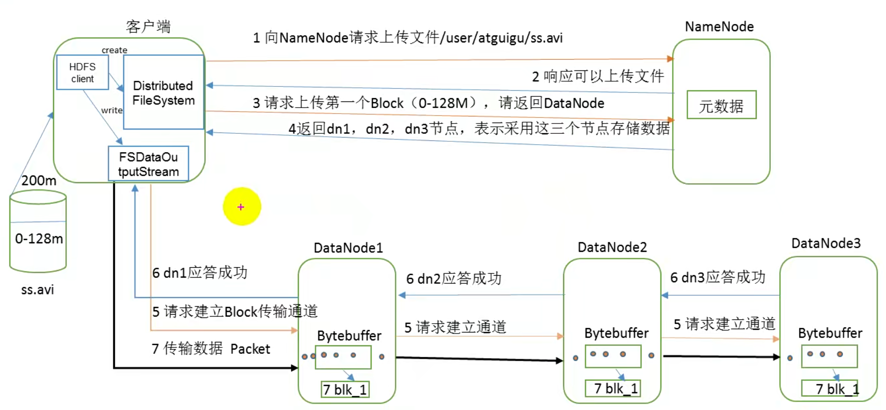
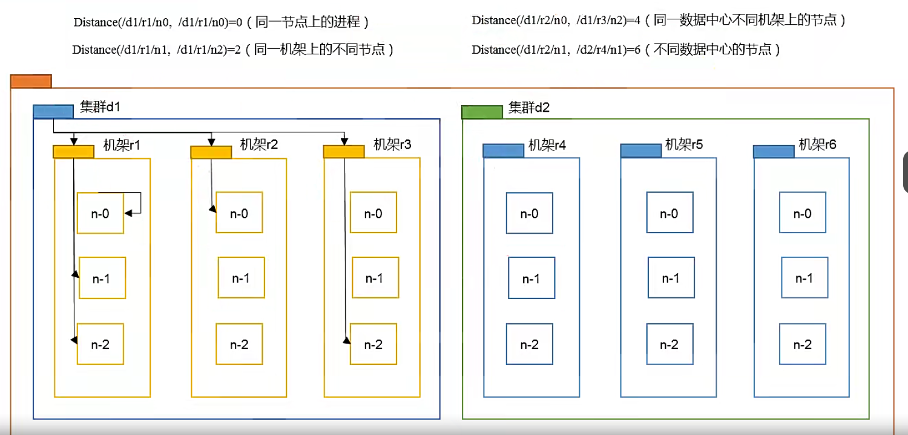
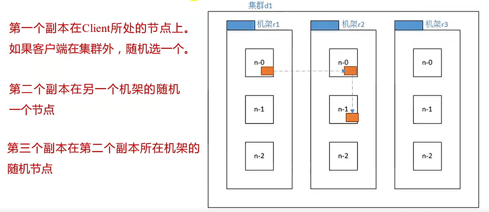
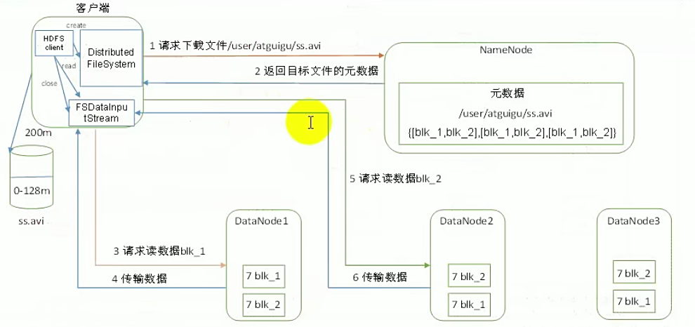
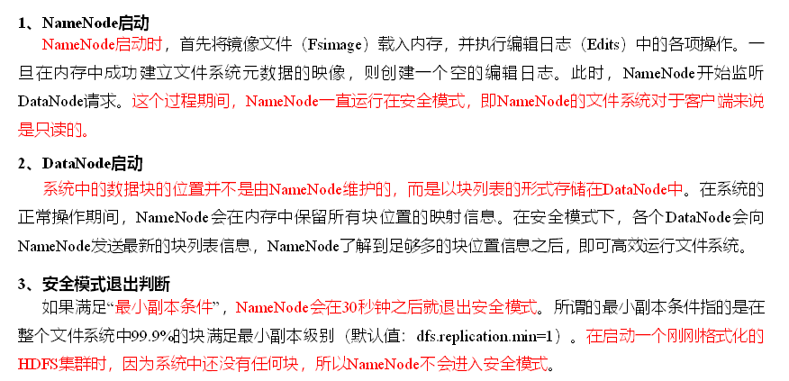
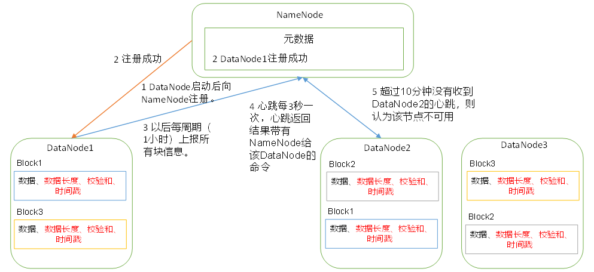

## HDFS概述

### 简介

随着数据量越来越大，在一个操作系统存不下所有的数据，那么就分配到更多的操作系统管理的磁盘中，但是不方便管理和维护，于是迫切需要一种系统来管理多台机器上的文件，这就是分布式文件管理系统。HDFS只是分布式文件管理系统中的一种。

HDFS是一个文件系统，用于存储文件，通过目录树来定位文件；其次，它是分布式的，由很多服务器联合起来实现其功能，集群中的服务器有 各自的角色。

HDFS的使用场景：市和一次写入，多次读出的场景，且不支持文件的修改。适合用来做数据分析，并不适合用来做网盘应用。

### 优缺点

1. 优点
   * 高容错性：数据自动保存多个副本。它通过增加副本的形式，提高容错性。某一个副本丢失以后，它可以自动恢复。
   * 适合处理大数据：1.能够处理数据规模达到GB、TB甚至PB级别的数据；2.能够处理百万规模以上的文件数量，数量相当之大。
   * 可构建在廉价极其上，通过多副本机制，提高可靠性。
2. 缺点
   * 不适合低延时数据访问，比如毫秒级别的存储数据，是做不到的。
   * 无法高效的对大量小文件进行存储。存储大量小文件的话，会占用NameNode大量的内存来存储文件目录和块信息。这样是不可取的，因为NameNode的内存总是有限的。小文件存储的寻址时间会超过读取时间，它违反了HDFS的设计目标。
   * 不支持并发写入、文件随机修改。一个文件只能有一个写入，不允许多个线程同时写；仅支持数据添加，不支持文件的随机修改。

### HDFS的组成架构

### HDFS的文件快大小

1. HDFS的块设置太小，会增加寻址时间，程序一直在找块的开始位置。
2. 如果块设置的太大，从磁盘传输数据的时间会明显大于定位这个块开始位置所需的时间。导致程序在处理这块数据时，会非常慢。
3. HDFS块的大小设置主要取决于磁盘传输速率。

## HDFS命令操作

## Java客户端操作HDFS

## HDFS的数据流

### HDFS写入数据流程

（1）客户端通过Distributed FileSystem模块向NameNode请求上传文件，NameNode检查目标文件是否已存在，父目录是否存在。

（2）NameNode返回是否可以上传。

（3）客户端请求第一个 Block上传到哪几个DataNode服务器上。

（4）NameNode返回3个DataNode节点，分别为dn1、dn2、dn3。

（5）客户端通过FSDataOutputStream模块请求dn1上传数据，dn1收到请求会继续调用dn2，然后dn2调用dn3，将这个通信管道建立完成。`为了减轻客户端IO压力，所以没有采用客户端对每个dn节点建里连接`。

（6）dn1、dn2、dn3逐级应答客户端。

（7）客户端开始往dn1上传第一个Block（先从磁盘读取数据放到一个本地内存缓存），以Packet为单位，dn1收到一个Packet就会传给dn2，dn2传给dn3；dn1每传一个packet会放入一个应答队列等待应答。

（8）当一个Block传输完成之后，客户端再次请求NameNode上传第二个Block的服务器。（重复执行3-7步）。

**问题思考**

1. HDFS根据请求返回DataNode的节点的策略？——`机架感知`

   如果当前Client所在机器有DataNode节点，那就返回当前机器DN1,否则从集群中随机一台。根据第一台机器的位置，然后再其他机架上随机一台，在第二台机器所在机架上再随机一台，依此类推。以上策略的缘由：为了提高数据的可靠性，同时一定程度也保证数据传输的效率！

2. 客户端建立传输通道的时候如何确定和哪一台DataNode先建立连接？——`网络拓扑`

   找离client最近的一台机器先建立通道。

3. Client为什么是以串行的方式建立通道？

   本质上就是为了降低client的IO开销

4. 数据传输的时候如何保证数据成功？

   采用了ack回执的策略保证了数据完整成功上传。

### 网络拓扑-节点距离计算

在HDFS写数据的过程中，NameNode会选择距离待上传数据最近距离的DataNode接收数据。

`节点距离：两个节点到达最近的共同祖先的距离总和。`

例如，假设有数据中心d1机架r1中的节点n1。该节点可以表示为/d1/r1/n1。利用这种标记，这里给出四种距离描述。

### 机架感知

### HDFS读数据流程

（1）客户端通过DistributedFileSystem向NameNode请求下载文件，NameNode通过查询元数据，找到文件块所在的DataNode地址。

（2）挑选一台DataNode（就近原则，然后随机）服务器，请求读取数据。

（3）DataNode开始传输数据给客户端（从磁盘里面读取数据输入流，以Packet为单位来做校验）。

（4）客户端以Packet为单位接收，先在本地缓存，然后写入目标文件。

## NN和2NN

### 工作机制

1. 元数据信息保存

   元数据保存在内存中，提高效率，并且在磁盘中备份元数据的FsImage，同时引入Edits文件（只进行追加操作，效率高）。每当元数据有更新或添加时，修改内存中的元数据并追加到Edits文件中。

2. 内存与磁盘中元数据维护策略

   对元数据进行操作时，首先在内存中进行修改，并且将操作追加到edits编辑日志文件中，在满足一定条件下，将edits文件中的记录合并到元数据FsImage文件中。

3. 元数据信息进行合并

   2NN主要负责对NN的元数据进行合并，当满足一定条件的下，2NN会检测本地时间，每隔一个小时会主动对NN的edits文件和fsimage文件进行一次合并。合并的时候，首先会通知NN,这时候NN就会停止对正在使用的edits文件的追加，同时会新建一个新的edits编辑日志文件，保证NN的正常工作。接下来 2NN会把NN本地的fsimage文件和edits编辑日志拉取到2NN的本地，在内存中对二者进行合并，最后产生最新fsimage文件。把最新的fsimage文件再发送给NN的本地。注意还有一个情况，当NN的edits文件中的操作次数累计达到100万次，即便还没到1小时，2NN（每隔60秒会检测一次NN方的edits文件的操作次数）也会进行合并。2NN 也会自己把最新的fsimage文件备份一份。

### 集群安全模式

## DateNode

（1）一个数据块在DataNode上以文件形式存储在磁盘上，包括两个文件，一个是数据本身，一个是元数据包括数据块的长度，块数据的校验和，以及时间戳。

（2）DataNode启动后向NameNode注册，通过后，周期性（1小时）的向NameNode上报所有的块信息。

（3）心跳是每3秒一次，心跳返回结果带有NameNode给该DataNode的命令如复制块数据到另一台机器，或删除某个数据块。如果超过10分钟没有收到某个DataNode的心跳，则认为该节点不可用。

（4）集群运行中可以安全加入和退出一些机器。
