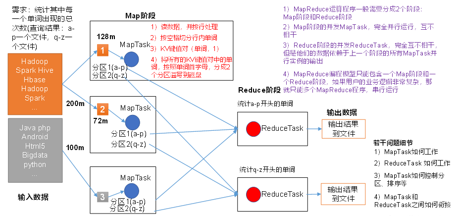
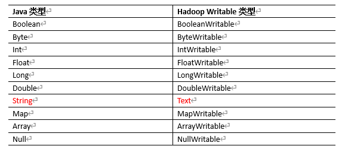
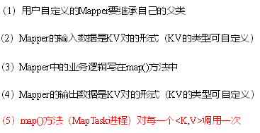
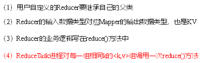

## MapReduce概述

MapReduce是一个分布式运算程序的编程框架，是用户开发“基于Hadoop的数据分析应用”的核心框架。

MapReduce核心功能是将用户编写的`业务逻辑代码和自带默认组件`整合成一个完整的分布式运算程序，并行运行在一个Hadoop集群上。

### 优点

1. **MapReduce 易于编程**
2. **良好的扩展性**
3. **高容错性**
4. **适合PB级以上海量数据的离线处理**

### 缺点

1. **不擅长实时计算**
2. **不擅长流式计算**
3. **不擅长DAG（有向无环图）计算**

### MapReduce核心思想



将多个文件拆分成多个100MB的切片进行MapTask处理。

（1）分布式的运算程序往往需要分成至少2个阶段。

（2）第一个阶段的MapTask并发实例，完全并行运行，互不相干。

（3）第二个阶段的ReduceTask并发实例互不相干，但是他们的数据依赖于上一个阶段的所有MapTask并发实例的输出。

（4）MapReduce编程模型只能包含一个Map阶段和一个Reduce阶段，如果用户的业务逻辑非常复杂，那就只能多个MapReduce程序，串行运行。

**MapReduce进程**：

（1）**MrAppMaster**：负责整个程序的过程调度及状态协调。

（2）**MapTask**：负责Map阶段的整个数据处理流程。

（3）**ReduceTask**：负责Reduce阶段的整个数据处理流程。

### 常用数据序列化类型



### MapReduce编程规范

1. Mapper阶段



2. Reduce阶段



3. Driver阶段

   相当于YARN集群的客户端，用户提交整个程序到YARN集群，提交的是封装了MapReduce程序相关运行参数的job对象。

### Hadoop序列化

#### 优点

1. **紧凑**：可以与压缩算法结合使用，高效使用存储空间。
2. **快速**：读写数据的额外开销小，不包含额外的元数据信息。
3. **可扩展**：可随着通信协议的升级而升级，可以轻松地扩展以支持自定义数据类型。
4. **互操作**：支持多语言交互。

#### 自定义序列化

（1）必须实现Writable接口

（2）反序列化时，需要反射调用空参构造函数，所以必须有空参构造

```java
public FlowBean() {
	super();
}
```

（3）重写序列化方法

```java
@Override
public void write(DataOutput out) throws IOException {
	out.writeLong(upFlow);
	out.writeLong(downFlow);
	out.writeLong(sumFlow);
}
```

（4）重写反序列化方法

```java
@Override
public void readFields(DataInput in) throws IOException {
	upFlow = in.readLong();
	downFlow = in.readLong();
	sumFlow = in.readLong();
}
```

（5）注意反序列化的顺序和序列化的顺序完全一致。

（6）要想把结果显示在文件中，需要重写toString()，可用”\t”分开，方便后续用。

（7）如果需要将自定义的bean放在key中传输，则还需要实现Comparable接口，因为MapReduce框中的Shuffle过程要求对key必须能排序。

```java
@Override
public int compareTo(FlowBean o) {
	// 倒序排列，从大到小
	return this.sumFlow > o.getSumFlow() ? -1 : 1;
}
```

