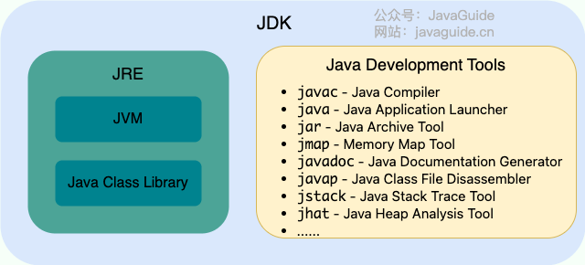

>参考地址
>https://javaguide.cn/
## Java基础概念
### Java语言特点
1. 简单易学（语法简单，上手容易）；
2. 面向对象（封装，继承，多态）；
3. 平台无关性（ Java 虚拟机实现平台无关性），一次编写，随处运行；
4. 3.支持多线程（ C++ 语言没有内置的多线程机制，因此必须调用操作系统的多线程功能来进行多线程程序设计，而 Java 语言却提供了多线程支持）；
5. 可靠性（具备异常处理和自动内存管理机制）；
6. 安全性（Java 语言本身的设计就提供了多重安全防护机制如访问权限修饰符、限制程序直接访问操作系统资源）；
7. 高效性（通过 Just In Time 编译器等技术的优化，Java 语言的运行效率还是非常不错的）；
8. 支持网络编程并且很方便；
9. 编译与解释并存；
10. 强大的技术生态等等。
### JavaSE和JavaEE
- Java SE（Java Platform，Standard Edition）: Java 平台标准版，Java 编程语言的基础，它包含了支持 Java 应用程序开发和运行的核心类库以及虚拟机等核心组件。Java SE 可以用于构建桌面应用程序或简单的服务器应用程序。
- Java EE（Java Platform, Enterprise Edition ）：Java 平台企业版，建立在 Java SE 的基础上，包含了支持企业级应用程序开发和部署的标准和规范（比如 Servlet、JSP、EJB、JDBC、JPA、JTA、JavaMail、JMS）。 Java EE 可以用于构建分布式、可移植、健壮、可伸缩和安全的服务端 Java 应用程序，例如 Web 应用程序。

简单来说，Java SE 是 Java 的基础版本，Java EE 是 Java 的高级版本。Java SE 更适合开发桌面应用程序或简单的服务器应用程序，Java EE 更适合开发复杂的企业级应用程序或 Web 应用程序。

除了 Java SE 和 Java EE，还有一个 Java ME（Java Platform，Micro Edition）。Java ME 是 Java 的微型版本，主要用于开发嵌入式消费电子设备的应用程序，例如手机、PDA、机顶盒、冰箱、空调等。Java ME 无需重点关注，知道有这个东西就好了，现在已经用不上了。
### JVM、JDK和JRE
* ==JVM==：Java 虚拟机（Java Virtual Machine, JVM）是运行 Java 字节码的虚拟机。JVM 有针对不同系统的特定实现（Windows，Linux，macOS），目的是使用相同的字节码，它们都会给出相同的结果。字节码和不同系统的 JVM 实现是 Java 语言“一次编译，随处可以运行”的关键所在。比如`.java`文件在通过`javac`编译成`.class`文件后，通过JVM在不同的平台（Windows、Mac、Linux）上运行。**JVM 并不是只有一种！只要满足 [JVM 规范](https://docs.oracle.com/javase/specs/index.html)就可以开发属于自己的JVM**，[常见的JVM](https://en.wikipedia.org/wiki/Comparison_of_Java_virtual_machines)有`HotSpot VM` 、 `J9 VM`、`Zing VM`、`JRockit VM`等。
* ==JRE==：是运行已编译 Java 程序所需的环境，主要包含以下两个部分：
	1. **JVM** : 也就是我们上面提到的 Java 虚拟机。
	2. **Java 基础类库（Class Library）**：一组标准的类库，提供常用的功能和 API（如 I/O 操作、网络通信、数据结构等）。
* ==JDK==：JDK（Java Development Kit）是一个功能齐全的 Java 开发工具包，供开发者使用，用于创建和编译 Java 程序。它包含了 JRE（Java Runtime Environment），以及编译器 javac 和其他工具，如 javadoc（文档生成器）、jdb（调试器）、jconsole（监控工具）、javap（反编译工具）等。

简单来说，JRE 只包含运行 Java 程序所需的环境和类库，而 JDK 不仅包含 JRE，还包括用于开发和调试 Java 程序的工具。

如果需要编写、编译 Java 程序或使用 Java API 文档，就需要安装 JDK。某些需要 Java 特性的应用程序（如 JSP 转换为 Servlet 或使用反射）也可能需要 JDK 来编译和运行 Java 代码。因此，即使不进行 Java 开发工作，有时也可能需要安装 JDK。

下图清晰展示了 JDK、JRE 和 JVM 的关系。

从 JDK 9 开始，就不需要区分 JDK 和 JRE 的关系了，在引入了模块系统之后，JDK 被重新组织成 94 个模块。Java 应用可以通过新增的 jlink 工具，创建出只包含所依赖的 JDK 模块的自定义运行时镜像。这样可以极大的减少 Java 运行时环境的大小。

定制的、模块化的 Java 运行时映像有助于简化 Java 应用的部署和节省内存并增强安全性和可维护性。这对于满足现代应用程序架构的需求，如虚拟化、容器化、微服务和云原生开发，是非常重要的。
### 什么是字节码?
在 Java 中，JVM 可以理解的代码就叫做字节码（即扩展名为 `.class` 的文件），它不面向任何特定的处理器，只面向虚拟机。Java 语言通过字节码的方式，在一定程度上解决了传统解释型语言执行效率低的问题，同时又保留了解释型语言可移植的特点。所以， Java 程序运行时相对来说还是高效的（但是和 C、 C++，Rust，Go 等语言还是有一定差距的），而且，由于字节码并不针对一种特定的机器，因此，Java 程序无须重新编译便可在多种不同操作系统的计算机上运行。

Java程序从源代码到运行的流程：


在.class到机器码之间，JVM 类加载器首先加载字节码文件，然后通过解释器逐行解释执行，这种方式的执行速度会相对比较慢。而且，有些方法和代码块是经常需要被调用的(也就是所谓的热点代码)，所以后面引进了 **JIT（Just in Time Compilation）** 编译器，而 JIT 属于运行时编译。当 JIT 编译器完成第一次编译后，其会将字节码对应的机器码保存下来，下次可以直接使用。机器码的运行效率肯定是高于 Java 解释器，这也解释了为什么经常会说 **Java 是编译与解释共存的语言** 。
> 🌈 拓展阅读：
> - [基本功 | Java 即时编译器原理解析及实践 - 美团技术团队](https://tech.meituan.com/2020/10/22/java-jit-practice-in-meituan.html)
> - [基于静态编译构建微服务应用 - 阿里巴巴中间件](https://mp.weixin.qq.com/s/4haTyXUmh8m-dBQaEzwDJw)


HotSpot 采用了惰性评估(Lazy Evaluation)的做法，根据二八定律，消耗大部分系统资源的只有那一小部分的代码（热点代码），而这也就是 JIT 所需要编译的部分。JVM 会根据代码每次被执行的情况收集信息并相应地做出一些优化，因此执行的次数越多，它的速度就越快。

下面这张图是 JVM 的大致结构模型：

### 为什么说 Java 语言“编译与解释并存”？
可以将高级编程语言按照程序的执行方式分为两种：
- **编译型**：[编译型语言](https://zh.wikipedia.org/wiki/%E7%B7%A8%E8%AD%AF%E8%AA%9E%E8%A8%80) 会通过[编译器](https://zh.wikipedia.org/wiki/%E7%B7%A8%E8%AD%AF%E5%99%A8)将源代码一次性翻译成可被该平台执行的机器码。一般情况下，编译语言的执行速度比较快，开发效率比较低。常见的编译性语言有 C、C++、Go、Rust 等等。
- **解释型**：[解释型语言](https://zh.wikipedia.org/wiki/%E7%9B%B4%E8%AD%AF%E8%AA%9E%E8%A8%80)会通过[解释器](https://zh.wikipedia.org/wiki/%E7%9B%B4%E8%AD%AF%E5%99%A8)一句一句的将代码解释（interpret）为机器代码后再执行。解释型语言开发效率比较快，执行速度比较慢。常见的解释性语言有 Python、JavaScript、PHP 等等。

> [!NOTE] 维基百科介绍
为了改善解释语言的效率而发展出的[即时编译](https://zh.wikipedia.org/wiki/%E5%8D%B3%E6%99%82%E7%B7%A8%E8%AD%AF)技术，已经缩小了这两种语言间的差距。这种技术混合了编译语言与解释型语言的优点，它像编译语言一样，先把程序源代码编译成[字节码](https://zh.wikipedia.org/wiki/%E5%AD%97%E8%8A%82%E7%A0%81)。到执行期时，再将字节码直译，之后执行。[Java](https://zh.wikipedia.org/wiki/Java)与[LLVM](https://zh.wikipedia.org/wiki/LLVM)是这种技术的代表产物。
相关阅读：[基本功 | Java 即时编译器原理解析及实践](https://tech.meituan.com/2020/10/22/java-jit-practice-in-meituan.html)

因为 Java 语言既具有编译型语言的特征，也具有解释型语言的特征。因为 Java 程序要经过先编译，后解释两个步骤，由 Java 编写的程序（`.java`文件）需要先经过编译步骤，生成字节码（`.class` 文件），这种字节码必须由 Java 解释器来解释执行。
### AOT 有什么优点？为什么不全部使用 AOT 呢？
JDK 9 引入了一种新的编译模式 **AOT(Ahead of Time Compilation)** 。和 JIT 不同的是，这种编译模式会在程序被执行前就将其编译成机器码，属于静态编译（C、 C++，Rust，Go 等语言就是静态编译）。AOT 避免了 JIT 预热等各方面的开销，可以提高 Java 程序的启动速度，避免预热时间长。并且，AOT 还能减少内存占用和增强 Java 程序的安全性（AOT 编译后的代码不容易被反编译和修改），特别适合云原生场景。

可以看出，AOT 的主要优势在于启动时间、内存占用和打包体积。JIT 的主要优势在于具备更高的极限处理能力，可以降低请求的最大延迟。

[GraalVM](https://www.graalvm.org/) 是一种高性能的 JDK（完整的 JDK 发行版本），它可以运行 Java 和其他 JVM 语言，以及 JavaScript、Python 等非 JVM 语言。 GraalVM 不仅能提供 AOT 编译，还能提供 JIT 编译。
相关阅读：
- [基于静态编译构建微服务应用](https://mp.weixin.qq.com/s/4haTyXUmh8m-dBQaEzwDJw)
- [走向 Native 化：Spring&Dubbo AOT 技术示例与原理讲解](https://cn.dubbo.apache.org/zh-cn/blog/2023/06/28/%e8%b5%b0%e5%90%91-native-%e5%8c%96springdubbo-aot-%e6%8a%80%e6%9c%af%e7%a4%ba%e4%be%8b%e4%b8%8e%e5%8e%9f%e7%90%86%e8%ae%b2%e8%a7%a3/)

JIT 与 AOT两者各有优点，只能说 AOT 更适合当下的云原生场景，对微服务架构的支持也比较友好。除此之外，AOT 编译无法支持 Java 的一些动态特性，如反射、动态代理、动态加载、JNI（Java Native Interface）等。
然而，很多框架和库（如 Spring、CGLIB）都用到了这些特性。如果只使用 AOT 编译，那就没办法使用这些框架和库了，或者说需要针对性地去做适配和优化。举个例子，CGLIB 动态代理使用的是 ASM 技术，而这种技术大致原理是运行时直接在内存中生成并加载修改后的字节码文件也就是 `.class` 文件，如果全部使用 AOT 提前编译，也就不能使用 ASM 技术了。
为了支持类似的动态特性，所以选择使用 JIT 即时编译器。
### Oracle JDK vs OpenJDK
Oracle JDK 和 OpenJDK 的区别：
1. **是否开源**：OpenJDK 是一个参考模型并且是完全开源的，而 Oracle JDK 是基于 OpenJDK 实现的，并不是完全开源的，OpenJDK 开源项目：[https://github.com/openjdk/jdk](https://github.com/openjdk/jdk) 。
2. **是否免费**：Oracle JDK 会提供免费版本，但一般有时间限制。JDK17 之后的版本可以免费分发和商用，但是仅有 3 年时间，3 年后无法免费商用。不过，JDK8u221 之前只要不升级可以无限期免费。OpenJDK 是完全免费的。
3. **功能性**：Oracle JDK 在 OpenJDK 的基础上添加了一些特有的功能和工具，比如 Java Flight Recorder（JFR，一种监控工具）、Java Mission Control（JMC，一种监控工具）等工具。不过，在 Java 11 之后，OracleJDK 和 OpenJDK 的功能基本一致，之前 OracleJDK 中的私有组件大多数也已经被捐赠给开源组织。
4. **稳定性**：OpenJDK 不提供 LTS 服务，而 OracleJDK 大概每三年都会推出一个 LTS 版进行长期支持。不过，很多公司都基于 OpenJDK 提供了对应的和 OracleJDK 周期相同的 LTS 版。因此，两者稳定性其实也是差不多的。
5. **协议**：Oracle JDK 使用 BCL/OTN 协议获得许可，而 OpenJDK 根据 GPL v2 许可获得许可。

> 🌈 拓展一下：
> BCL 协议（Oracle Binary Code License Agreement）：可以使用 JDK（支持商用），但是不能进行修改。
> OTN 协议（Oracle Technology Network License Agreement）：11 及之后新发布的 JDK 用的都是这个协议，可以自己私下用，但是商用需要付费
### Java 和 C++ 的区别?
Java 和 C++ 都是面向对象的语言，都支持封装、继承和多态，但还是有挺多不相同的地方：
- Java 不提供指针来直接访问内存，程序内存更加安全
- Java 的类是单继承的，C++ 支持多重继承；虽然 Java 的类不可以多继承，但是接口可以多继承。
- Java 有自动内存管理垃圾回收机制(GC)，不需要程序员手动释放无用内存。
- C ++同时支持方法重载和操作符重载，但是 Java 只支持方法重载。
## 基本语法
### 注释有哪几种形式？
Java 中的注释有三种：
1. **单行注释**：通常用于解释方法内某单行代码的作用。
2. **多行注释**：通常用于解释一段代码的作用。
3. **文档注释**：通常用于生成 Java 开发文档。
**代码的注释不是越详细越好。实际上好的代码本身就是注释，要尽量规范和美化自己的代码来减少不必要的注释。**
举个例子：
去掉下面复杂的注释，只需要创建一个与注释所言同一事物的函数即可
```
// check to see if the employee is eligible for full benefits
if ((employee.flags & HOURLY_FLAG) && (employee.age > 65))
```
应替换为
```
if (employee.isEligibleForFullBenefits())
```
### Java 语言关键字有哪些？

所有的[关键字](https://docs.oracle.com/javase/tutorial/java/nutsandbolts/_keywords.html)都是小写的，在 IDE 中会以特殊颜色显示。
`default` 这个关键字很特殊，既属于程序控制，也属于类，方法和变量修饰符，还属于访问控制。
- 在程序控制中，当在 `switch` 中匹配不到任何情况时，可以使用 `default` 来编写默认匹配的情况。
- 在类，方法和变量修饰符中，从 JDK8 开始引入了默认方法，可以使用 `default` 关键字来定义一个方法的默认实现。
- 在访问控制中，如果一个方法前没有任何修饰符，则默认会有一个修饰符 `default`，但是这个修饰符加上了就会报错。
⚠️ 注意：虽然 `true`, `false`, 和 `null` 看起来像关键字但实际上是字面值，同时也不可以作为标识符来使用。
### 自增自减运算符
Java 提供了自增运算符 (`++`) 和自减运算符 (`--`) 来简化这种操作。
`++` 和 `--` 运算符可以放在变量之前，也可以放在变量之后：
- **前缀形式**（例如 `++a` 或 `--a`）：先自增/自减变量的值，然后再使用该变量，例如，`b = ++a` 先将 `a` 增加 1，然后把增加后的值赋给 `b`。
- **后缀形式**（例如 `a++` 或 `a--`）：先使用变量的当前值，然后再自增/自减变量的值。例如，`b = a++` 先将 `a` 的当前值赋给 `b`，然后再将 `a` 增加 1。
```
int a = 9;
int b = a++;
int c = ++a;
int d = c--;
int e = --d;
```
计算结果：`a = 11` 、`b = 9` 、 `c = 10` 、 `d = 10` 、 `e = 10`。
### 移位运算符
移位运算符在各种框架以及 JDK 自身的源码中使用还是挺广泛的，`HashMap`（JDK1.8） 中的 `hash` 方法的源码就用到了移位运算符：
```java
static final int hash(Object key) {
    int h;
    // key.hashCode()：返回散列值也就是hashcode
    // ^：按位异或
    // >>>:无符号右移，忽略符号位，空位都以0补齐
    return (key == null) ? 0 : (h = key.hashCode()) ^ (h >>> 16);
}
```
**使用移位运算符的主要原因**：
1. **高效**：移位运算符直接对应于处理器的移位指令。现代处理器具有专门的硬件指令来执行这些移位操作，这些指令通常在一个时钟周期内完成。相比之下，乘法和除法等算术运算在硬件层面上需要更多的时钟周期来完成。
2. **节省内存**：通过移位操作，可以使用一个整数（如 `int` 或 `long`）来存储多个布尔值或标志位，从而节省内存。

移位运算符最常用于快速乘以或除以 2 的幂次方。除此之外，它还在以下方面发挥着重要作用：
- **位字段管理**：例如存储和操作多个布尔值。
- **哈希算法和加密解密**：通过移位和与、或等操作来混淆数据。
- **数据压缩**：例如霍夫曼编码通过移位运算符可以快速处理和操作二进制数据，以生成紧凑的压缩格式。
- **数据校验**：例如 CRC（循环冗余校验）通过移位和多项式除法生成和校验数据完整性。。
- **内存对齐**：通过移位操作，可以轻松计算和调整数据的对齐地址。

Java 中有三种移位运算符：
- `<<` :左移运算符，向左移若干位，高位丢弃，低位补零。`x << n`,相当于 x 乘以 2 的 n 次方(不溢出的情况下)。
- `>>` :带符号右移，向右移若干位，高位补符号位，低位丢弃。正数高位补 0,负数高位补 1。`x >> n`,相当于 x 除以 2 的 n 次方。
- `>>>` :无符号右移，忽略符号位，空位都以 0 补齐。
虽然移位运算本质上可以分为左移和右移，但实际应用中，右移操作需要考虑符号位的处理方式。
由于 `double`，`float` 在二进制中的表现比较特殊，因此不能来进行移位操作。
移位操作符实际上支持的类型只有`int`和`long`，编译器在对`short`、`byte`、`char`类型进行移位前，都会将其转换为`int`类型再操作。

当 int 类型左移/右移位数大于等于 32 位操作时，会先对位移值取模后再进行左移/右移操作。由于 long 对应的二进制是 64 位，因此取模操作的基数也变成了 64。
```java
#代码
int i = -1;
System.out.println("初始数据：" + i);
System.out.println("初始数据对应的二进制字符串：" + Integer.toBinaryString(i));
i <<= 42;
System.out.println("左移 10 位后的数据 " + i);
System.out.println("左移 10 位后的数据对应的二进制字符 " + Integer.toBinaryString(i));
#结果
初始数据：-1
初始数据对应的二进制字符串：11111111111111111111111111111111
左移 10 位后的数据 -1024
左移 10 位后的数据对应的二进制字符 11111111111111111111110000000000
```
### continue、break 和 return 的区别是什么？
在循环结构中，当循环条件不满足或者循环次数达到要求时，循环会正常结束。但是，有时候可能需要在循环的过程中，当发生了某种条件之后 ，提前终止循环，这就需要用到下面几个关键词：
1. `continue`：指跳出当前的这一次循环，继续下一次循环。
2. `break`：指跳出整个循环体，继续执行循环下面的语句。

`return` 用于跳出所在方法，结束该方法的运行。return 一般有两种用法：
1. `return;`：直接使用 return 结束方法执行，用于没有返回值函数的方法
2. `return value;`：return 一个特定值，用于有返回值函数的方法
## 基本数据类型
Java 中有 8 种基本数据类型，分别为：
- 6 种数字类型：
    - 4 种整数型：`byte`、`short`、`int`、`long`
    - 2 种浮点型：`float`、`double`
- 1 种字符类型：`char`
- 1 种布尔型：`boolean`。
这 8 种基本数据类型的默认值以及所占空间的大小如下：

Java 的每种基本类型所占存储空间的大小不会像其他大多数语言那样随机器硬件架构的变化而变化。这种所占存储空间大小的不变性是 Java 程序比用其他大多数语言编写的程序更具可移植性的原因之一。
**注意：**
1. Java 里使用 `long` 类型的数据一定要在数值后面加上 **L**，否则将作为整型解析。
2. Java 里使用 `float` 类型的数据一定要在数值后面加上 **f 或 F**，否则将无法通过编译。
3. `char a = 'h'`char :单引号，`String a = "hello"` :双引号。
这八种基本类型都有对应的包装类分别为：`Byte`、`Short`、`Integer`、`Long`、`Float`、`Double`、`Character`、`Boolean` 。
### 基本类型和包装类型的区别？
- **用途**：除了定义一些常量和局部变量之外，我们在其他地方比如方法参数、对象属性中很少会使用基本类型来定义变量。并且，包装类型可用于泛型，而基本类型不可以。
- **存储方式**：基本数据类型的局部变量存放在 Java 虚拟机栈中的局部变量表中，基本数据类型的成员变量（未被 `static` 修饰 ）存放在 Java 虚拟机的堆中。包装类型属于对象类型，几乎所有对象实例都存在于堆中。
- **占用空间**：相比于包装类型（对象类型）， 基本数据类型占用的空间往往非常小。
- - **默认值**：成员变量包装类型不赋值就是 `null` ，而基本类型有默认值且不是 `null`。
- **比较方式**：对于基本数据类型来说，<strong>==</strong>比较的是值。对于包装数据类型来说，<strong>==</strong> 比较的是对象的内存地址。所有整型包装类对象之间值的比较，全部使用 `equals()` 方法。
**为什么说是几乎所有对象实例都存在于堆中呢？** 这是因为 HotSpot 虚拟机引入了 JIT 优化之后，会对对象进行逃逸分析，如果发现某一个对象并没有逃逸到方法外部，那么就可能通过标量替换来实现栈上分配，而避免堆上分配内存。
⚠️ 注意：**基本数据类型存放在栈中是一个常见的误区！** 基本数据类型的存储位置取决于它们的作用域和声明方式。如果它们是局部变量，那么它们会存放在栈中；如果它们是成员变量，那么它们会存放在堆/方法区/元空间中。
```java
public class Test {
    // 成员变量，存放在堆中
    int a = 10;
    // 被 static 修饰的成员变量，JDK 1.7 及之前位于方法区，1.8 后存放于元空间，均不存放于堆中。
    // 变量属于类，不属于对象。
    static int b = 20;

    public void method() {
        // 局部变量，存放在栈中
        int c = 30;
        static int d = 40; // 编译错误，不能在方法中使用 static 修饰局部变量
    }
}
```
### 包装类型的缓存机制了解么？
Java 基本数据类型的包装类型的大部分都用到了缓存机制来提升性能。
`Byte`,`Short`,`Integer`,`Long` 这 4 种包装类默认创建了数值 **[-128，127]** 的相应类型的缓存数据，`Character` 创建了数值在 **[0,127]** 范围的缓存数据，`Boolean` 直接返回 `True` or `False`。

**Integer缓存源码：**
```java
public static Integer valueOf(int i) {
    if (i >= IntegerCache.low && i <= IntegerCache.high)
        return IntegerCache.cache[i + (-IntegerCache.low)];
    return new Integer(i);
}
private static class IntegerCache {
    static final int low = -128;
    static final int high;
    static {
        // high value may be configured by property
        int h = 127;
    }
}
```

**Character缓存源码:**
```java
public static Character valueOf(char c) {
    if (c <= 127) { // must cache
      return CharacterCache.cache[(int)c];
    }
    return new Character(c);
}

private static class CharacterCache {
    private CharacterCache(){}
    static final Character cache[] = new Character[127 + 1];
    static {
        for (int i = 0; i < cache.length; i++)
            cache[i] = new Character((char)i);
    }
}
```

**Boolean缓存源码：**
```java
public static Boolean valueOf(boolean b) {
    return (b ? TRUE : FALSE);
}
```

如果超出对应范围仍然会去创建新的对象，缓存的范围区间的大小只是在性能和资源之间的权衡。

两种浮点数类型的包装类 `Float`,`Double` 并没有实现缓存机制。

```java
Integer i1 = 33;
Integer i2 = 33;
System.out.println(i1 == i2);// 输出 true

Float i11 = 333f;
Float i22 = 333f;
System.out.println(i11 == i22);// 输出 false

Double i3 = 1.2;
Double i4 = 1.2;
System.out.println(i3 == i4);// 输出 false
```

```java
Integer i1 = 40;
Integer i2 = new Integer(40);
System.out.println(i1==i2); //false
```

`Integer i1=40` 这一行代码会发生装箱，也就是说这行代码等价于 `Integer i1=Integer.valueOf(40)` 。因此，`i1` 直接使用的是缓存中的对象。而`Integer i2 = new Integer(40)` 会直接创建新的对象。

**所有整型包装类对象之间值的比较，全部使用 equals 方法比较**。
### 自动装箱与拆箱了解吗？原理是什么？
**什么是自动拆装箱？**
- **装箱**：将基本类型用它们对应的引用类型包装起来；
- **拆箱**：将包装类型转换为基本数据类型；
```java
Integer i = 10;  //装箱
int n = i;   //拆箱
```
上面这两行代码对应的字节码为：
```java
   L1

    LINENUMBER 8 L1

    ALOAD 0

    BIPUSH 10

    INVOKESTATIC java/lang/Integer.valueOf (I)Ljava/lang/Integer;

    PUTFIELD AutoBoxTest.i : Ljava/lang/Integer;

   L2

    LINENUMBER 9 L2

    ALOAD 0

    ALOAD 0

    GETFIELD AutoBoxTest.i : Ljava/lang/Integer;

    INVOKEVIRTUAL java/lang/Integer.intValue ()I

    PUTFIELD AutoBoxTest.n : I

    RETURN
```
从字节码中，可以发现装箱其实就是调用了 包装类的`valueOf()`方法，拆箱其实就是调用了 `xxxValue()`方法。

- `Integer i = 10` 等价于 `Integer i = Integer.valueOf(10)`
- `int n = i` 等价于 `int n = i.intValue()`;
注意：**如果频繁拆装箱的话，也会严重影响系统的性能。应该尽量避免不必要的拆装箱操作。**
```java
private static long sum() {
    // 应该使用 long 而不是 Long
    Long sum = 0L;
    for (long i = 0; i <= Integer.MAX_VALUE; i++)
        sum += i;
    return sum;
}
```
### 为什么浮点数运算的时候会有精度丢失的风险？
[浮点数运算精度](http://kaito-kidd.com/2018/08/08/computer-system-float-point/)丢失代码演示：
```java
float a = 2.0f - 1.9f;
float b = 1.8f - 1.7f;
System.out.printf("%.9f",a);// 0.100000024
System.out.println(b);// 0.099999905
System.out.println(a == b);// false
```
计算机在表示一个数字时，宽度是有限的，无限循环的小数存储在计算机时，只能被截断，所以就会导致小数精度发生损失的情况。这也就是解释了为什么浮点数没有办法用二进制精确表示。
就比如说十进制下的 0.2 就没办法精确转换成二进制小数：
```java
// 0.2 转换为二进制数的过程为，不断乘以 2，直到不存在小数为止，
// 在这个计算过程中，得到的整数部分从上到下排列就是二进制的结果。
0.2 * 2 = 0.4 -> 0
0.4 * 2 = 0.8 -> 0
0.8 * 2 = 1.6 -> 1
0.6 * 2 = 1.2 -> 1
0.2 * 2 = 0.4 -> 0（发生循环）
```

`BigDecimal` 可以实现对浮点数的运算，不会造成精度丢失。通常情况下，大部分需要浮点数精确运算结果的业务场景（比如涉及到钱的场景）都是通过 `BigDecimal` 来做的。
```java
BigDecimal a = new BigDecimal("1.0");
BigDecimal b = new BigDecimal("1.00");
BigDecimal c = new BigDecimal("0.8");

BigDecimal x = a.subtract(c);
BigDecimal y = b.subtract(c);

System.out.println(x); /* 0.2 */
System.out.println(y); /* 0.20 */
// 比较内容，不是比较值
System.out.println(Objects.equals(x, y)); /* false */
// 比较值相等用相等compareTo，相等返回0
System.out.println(0 == x.compareTo(y)); /* true */
```

基本数值类型都有一个表达范围，如果超过这个范围就会有数值溢出的风险。在 Java 中，64 位 long 整型是最大的整数类型。
```java
long l = Long.MAX_VALUE;
System.out.println(l + 1); // -9223372036854775808
System.out.println(l + 1 == Long.MIN_VALUE); // true
```
`BigInteger` 内部使用 `int[]` 数组来存储任意大小的整形数据。
相对于常规整数类型的运算来说，`BigInteger` 运算的效率会相对较低。
## 变量
### 成员变量与局部变量的区别？
- **语法形式**：从语法形式上看，成员变量是属于类的，而局部变量是在代码块或方法中定义的变量或是方法的参数；成员变量可以被 `public`,`private`,`static` 等修饰符所修饰，而局部变量不能被访问控制修饰符及 `static` 所修饰；但是，成员变量和局部变量都能被 `final` 所修饰。
- **存储方式**：从变量在内存中的存储方式来看，如果成员变量是使用 `static` 修饰的，那么这个成员变量是属于类的，如果没有使用 `static` 修饰，这个成员变量是属于实例的。而对象存在于堆内存，局部变量则存在于栈内存。
- **生存时间**：从变量在内存中的生存时间上看，成员变量是对象的一部分，它随着对象的创建而存在，而局部变量随着方法的调用而自动生成，随着方法的调用结束而消亡。
- **默认值**：从变量是否有默认值来看，成员变量如果没有被赋初始值，则会自动以类型的默认值而赋值（一种情况例外:被 `final` 修饰的成员变量也必须显式地赋值），而局部变量则不会自动赋值。

**为什么成员变量有默认值？**
1. 先不考虑变量类型，如果没有默认值会怎样？变量存储的是内存地址对应的任意随机值，程序读取该值运行会出现意外。
2. 默认值有两种设置方式：手动和自动，根据第一点，没有手动赋值一定要自动赋值。成员变量在运行时可借助反射等方法手动赋值，而局部变量不行。
3. 对于编译器（javac）来说，局部变量没赋值很好判断，可以直接报错。而成员变量可能是运行时赋值，无法判断，误报“没默认值”又会影响用户体验，所以采用自动赋默认值。
成员变量与局部变量代码示例：
```java
public class VariableExample {

    // 成员变量
    private String name;
    private int age;

    // 方法中的局部变量
    public void method() {
        int num1 = 10; // 栈中分配的局部变量
        String str = "Hello, world!"; // 栈中分配的局部变量
        System.out.println(num1);
        System.out.println(str);
    }

    // 带参数的方法中的局部变量
    public void method2(int num2) {
        int sum = num2 + 10; // 栈中分配的局部变量
        System.out.println(sum);
    }

    // 构造方法中的局部变量
    public VariableExample(String name, int age) {
        this.name = name; // 对成员变量进行赋值
        this.age = age; // 对成员变量进行赋值
        int num3 = 20; // 栈中分配的局部变量
        String str2 = "Hello, " + this.name + "!"; // 栈中分配的局部变量
        System.out.println(num3);
        System.out.println(str2);
    }
}
```
### 静态变量有什么作用？
静态变量也就是被 `static` 关键字修饰的变量。它可以被类的所有实例共享，无论一个类创建了多少个对象，它们都共享同一份静态变量。也就是说，静态变量只会被分配一次内存，即使创建多个对象，这样可以节省内存。

静态变量是通过类名来访问的，例如`StaticVariableExample.staticVar`（如果被 `private`关键字修饰就无法这样访问了）。通常情况下，静态变量会被 `final` 关键字修饰成为常量。
### 字符型常量和字符串常量的区别?
- **形式** : 字符常量是单引号引起的一个字符，字符串常量是双引号引起的 0 个或若干个字符。
- **含义** : 字符常量相当于一个整型值( ASCII 值),可以参加表达式运算; 字符串常量代表一个地址值(该字符串在内存中存放位置)。
- **占内存大小**：字符常量只占 2 个字节; 字符串常量占若干个字节。
⚠️ 注意 `char` 在 Java 中占两个字节。

字符型常量和字符串常量代码示例：
```java
public class StringExample {
    // 字符型常量
    public static final char LETTER_A = 'A';

    // 字符串常量
    public static final String GREETING_MESSAGE = "Hello, world!";
    public static void main(String[] args) {
        System.out.println("字符型常量占用的字节数为："+Character.BYTES);
        System.out.println("字符串常量占用的字节数为："+GREETING_MESSAGE.getBytes().length);
    }
}
//输出
字符型常量占用的字节数为：2
字符串常量占用的字节数为：13
```
## 方法

### 什么是方法的返回值?方法有哪几种类型？
**方法的返回值** 是指我们获取到的某个方法体中的代码执行后产生的结果！（前提是该方法可能产生结果）。返回值的作用是接收出结果，使得它可以用于其他的操作！
可以按照方法的返回值和参数类型将方法分为下面这几种：
**1、无参数无返回值的方法**
```java
public void f1() {
    //......
}
// 下面这个方法也没有返回值，虽然用到了 return
public void f(int a) {
    if (...) {
        // 表示结束方法的执行,下方的输出语句不会执行
        return;
    }
    System.out.println(a);
}
```
**2、有参数无返回值的方法**
```java
public void f2(Parameter 1, ..., Parameter n) {
    //......
}
```
**3、有返回值无参数的方法**
```java
public int f3() {
    //......
    return x;
}
```
**4、有返回值有参数的方法**
```java
public int f4(int a, int b) {
    return a * b;
}
```
### 静态方法为什么不能调用非静态成员?
这个需要结合 JVM 的相关知识，主要原因如下：
1. 静态方法是属于类的，在类加载的时候就会分配内存，可以通过类名直接访问。而非静态成员属于实例对象，只有在对象实例化之后才存在，需要通过类的实例对象去访问。
2. 在类的非静态成员不存在的时候静态方法就已经存在了，此时调用在内存中还不存在的非静态成员，属于非法操作。
```java
public class Example {
    // 定义一个字符型常量
    public static final char LETTER_A = 'A';

    // 定义一个字符串常量
    public static final String GREETING_MESSAGE = "Hello, world!";

    public static void main(String[] args) {
        // 输出字符型常量的值
        System.out.println("字符型常量的值为：" + LETTER_A);

        // 输出字符串常量的值
        System.out.println("字符串常量的值为：" + GREETING_MESSAGE);
    }
}
```
### 静态方法和实例方法有何不同？
**1、调用方式**
在外部调用静态方法时，可以使用 `类名.方法名` 的方式，也可以使用 `对象.方法名` 的方式，而实例方法只有后面这种方式。也就是说，**调用静态方法可以无需创建对象** 。
不过，需要注意的是一般不建议使用 `对象.方法名` 的方式来调用静态方法。这种方式非常容易造成混淆，静态方法不属于类的某个对象而是属于这个类。
```java
public class Person {
    public void method() {
      //......
    }

    public static void staicMethod(){
      //......
    }
    public static void main(String[] args) {
        Person person = new Person();
        // 调用实例方法
        person.method();
        // 调用静态方法
        Person.staicMethod()
    }
}
```
**2、访问类成员是否存在限制**
静态方法在访问本类的成员时，只允许访问静态成员（即静态成员变量和静态方法），不允许访问实例成员（即实例成员变量和实例方法），而实例方法不存在这个限制。
### 重载和重写有什么区别？

- 重载就是同样的一个方法能够根据输入数据的不同，做出不同的处理
- 重写就是当子类继承自父类的相同方法，输入数据一样，但要做出有别于父类的响应时，就要覆盖父类方法。

**重载**
发生在同一个类中（或者父类和子类之间），方法名必须相同，参数类型不同、个数不同、顺序不同，方法返回值和访问修饰符可以不同。
编译器必须挑选出具体执行哪个方法，它通过用各个方法给出的参数类型与特定方法调用所使用的值类型进行匹配来挑选出相应的方法。 如果编译器找不到匹配的参数， 就会产生编译时错误， 因为根本不存在匹配， 或者没有一个比其他的更好，这个过程被称为**重载解析(overloading resolution)**。
Java 允许重载任何方法， 而不只是构造器方法。

**重写**
重写发生在运行期，是子类对父类的允许访问的方法的实现过程进行重新编写。
1. 方法名、参数列表必须相同，子类方法返回值类型应比父类方法返回值类型更小或相等，抛出的异常范围小于等于父类，访问修饰符范围大于等于父类。
2. 如果父类方法访问修饰符为 `private/final/static` 则子类就不能重写该方法，但是被 `static` 修饰的方法能够被再次声明。
3. 构造方法无法被重写
综上：**重写就是子类对父类方法的重新改造，外部样子不能改变，内部逻辑可以改变。**

**方法的重写要遵循“两同两小一大”**
- “两同”即方法名相同、形参列表相同；
- “两小”指的是子类方法返回值类型应比父类方法返回值类型更小或相等，子类方法声明抛出的异常类应比父类方法声明抛出的异常类更小或相等；
- “一大”指的是子类方法的访问权限应比父类方法的访问权限更大或相等。
⭐️ 关于 **重写的返回值类型**：如果**方法的返回类型是 void 和基本数据类型，则返回值重写时不可修改**。但是如果**方法的返回值是引用类型，重写时是可以返回该引用类型的子类**的。
```java
public class Hero {
    public String name() {
        return "超级英雄";
    }
}
public class SuperMan extends Hero{
    @Override
    public String name() {
        return "超人";
    }
    public Hero hero() {
        return new Hero();
    }
}

public class SuperSuperMan extends SuperMan {
    @Override
    public String name() {
        return "超级超级英雄";
    }

    @Override
    public SuperMan hero() {
        return new SuperMan();
    }
}
```
### 什么是可变长参数？
从 Java5 开始，Java 支持定义可变长参数，所谓可变长参数就是允许在调用方法时传入不定长度的参数。就比如下面这个方法就可以接受 0 个或者多个参数。另外，可变参数只能作为函数的最后一个参数，其前面可以有也可以没有任何其他参数。
```java
public static void method2(String arg1, String... args) { //...... }
```
**遇到方法重载的情况**：会优先匹配固定参数的方法，因为固定参数的方法匹配度更高。
```java
public class VariableLengthArgument {

    public static void printVariable(String... args) {
        for (String s : args) {
            System.out.println(s);
        }
    }

    public static void printVariable(String arg1, String arg2) {
        System.out.println(arg1 + arg2);
    }

    public static void main(String[] args) {
        printVariable("a", "b");
        printVariable("a", "b", "c", "d");
    }
}
输出
ab
a
b
c
d
```
另外，Java 的可变参数编译后实际会被转换成一个数组，看编译后生成的 `class`文件就可以看出来了。
```java
public class VariableLengthArgument {
    public static void printVariable(String... args) {
        String[] var1 = args;
        int var2 = args.length;
        for(int var3 = 0; var3 < var2; ++var3) {
            String s = var1[var3];
            System.out.println(s);
        }
    }
}
```
## [参考](#参考)
- What is the difference between JDK and JRE?：[https://stackoverflow.com/questions/1906445/what-is-the-difference-between-jdk-and-jre](https://stackoverflow.com/questions/1906445/what-is-the-difference-between-jdk-and-jre)
- Oracle vs OpenJDK：[https://www.educba.com/oracle-vs-openjdk/](https://www.educba.com/oracle-vs-openjdk/)
- Differences between Oracle JDK and OpenJDK：[https://stackoverflow.com/questions/22358071/differences-between-oracle-jdk-and-openjdk](https://stackoverflow.com/questions/22358071/differences-between-oracle-jdk-and-openjdk)
- 彻底弄懂 Java 的移位操作符：[https://juejin.cn/post/6844904025880526861](https://juejin.cn/post/6844904025880526861)
## 面向对象基础
### 面向对象和面向过程的区别
面向过程编程（Procedural-Oriented Programming，POP）和面向对象编程（Object-Oriented Programming，OOP）是两种常见的编程范式，两者的主要区别在于解决问题的方式不同：
- **面向过程编程（POP）**：面向过程把解决问题的过程拆成一个个方法，通过一个个方法的执行解决问题。
- **面向对象编程（OOP）**：面向对象会先抽象出对象，然后用对象执行方法的方式解决问题。

相比较于 POP，OOP 开发的程序一般具有下面这些优点：
- **易维护**：由于良好的结构和封装性，OOP 程序通常更容易维护。
- **易复用**：通过继承和多态，OOP 设计使得代码更具复用性，方便扩展功能。
- **易扩展**：模块化设计使得系统扩展变得更加容易和灵活。

POP 的编程方式通常更为简单和直接，适合处理一些较简单的任务。

POP 和 OOP 的性能差异主要取决于它们的运行机制，而不仅仅是编程范式本身。因此，简单地比较两者的性能是一个常见的误区（相关 issue : [面向过程：面向过程性能比面向对象高？？](https://github.com/Snailclimb/JavaGuide/issues/431) ）。

### 创建一个对象用什么运算符?对象实体与对象引用有何不同?
**new 运算符**，new 创建对象实例（对象实例在堆内存中），对象引用指向对象实例（对象引用存放在栈内存中）。
- 一个对象引用可以指向 0 个或 1 个对象（一根绳子可以不系气球，也可以系一个气球）；
- 一个对象可以有 n 个引用指向它（可以用 n 条绳子系住一个气球）。
### 对象的相等和引用相等的区别
- 对象的相等一般比较的是内存中存放的内容是否相等。
- 引用相等一般比较的是他们指向的内存地址是否相等。
```java
String str1 = "hello";
String str2 = new String("hello");
String str3 = "hello";
// 使用 == 比较字符串的引用相等
System.out.println(str1 == str2);
System.out.println(str1 == str3);
// 使用 equals 方法比较字符串的相等
System.out.println(str1.equals(str2));
System.out.println(str1.equals(str3));
输出
false
true
true
true
```
从上面的代码输出结果可以看出：
- `str1` 和 `str2` 不相等，而 `str1` 和 `str3` 相等。这是因为 == 运算符比较的是字符串的引用是否相等。
- `str1`、 `str2`、`str3` 三者的内容都相等。这是因为`equals` 方法比较的是字符串的内容，即使这些字符串的对象引用不同，只要它们的内容相等，就认为它们是相等的
### 如果一个类没有声明构造方法，该程序能正确执行吗?
构造方法是一种特殊的方法，主要作用是完成对象的初始化工作。

如果一个类没有声明构造方法，也可以执行！因为一个类即使没有声明构造方法也会有默认的不带参数的构造方法。如果我们自己添加了类的构造方法（无论是否有参），Java 就不会添加默认的无参数的构造方法了。

在创建对象的时候后面要加一个括号（因为要调用无参的构造方法）。如果重载了有参的构造方法，记得都要把无参的构造方法也写出来（无论是否用到），因为这可以帮助在创建对象的时候少踩坑。
### 构造方法有哪些特点？是否可被 override?
构造方法具有以下特点：
- **名称与类名相同**：构造方法的名称必须与类名完全一致。
- **没有返回值**：构造方法没有返回类型，且不能使用 `void` 声明。
- **自动执行**：在生成类的对象时，构造方法会自动执行，无需显式调用。
构造方法**不能被重写（override）**，但**可以被重载（overload）**。因此，一个类中可以有多个构造方法，这些构造方法可以具有不同的参数列表，以提供不同的对象初始化方式。不能用**final、static**标识
### 面向对象三大特征
#### 封装
封装是指把一个对象的状态信息（也就是属性）隐藏在对象内部，不允许外部对象直接访问对象的内部信息。但是可以提供一些可以被外界访问的方法来操作属性。就好像我们看不到挂在墙上的空调的内部的零件信息（也就是属性），但是可以通过遥控器（方法）来控制空调。如果属性不想被外界访问，我们大可不必提供方法给外界访问。但是如果一个类没有提供给外界访问的方法，那么这个类也没有什么意义了。就好像如果没有空调遥控器，那么我们就无法操控空凋制冷，空调本身就没有意义了。
#### 继承
不同类型的对象，相互之间经常有一定数量的共同点。继承是使用已存在的类的定义作为基础建立新类的技术，新类的定义可以增加新的数据或新的功能，也可以用父类的功能，但不能选择性地继承父类。通过使用继承，可以快速地创建新的类，可以提高代码的重用，程序的可维护性，节省大量创建新类的时间 ，提高我们的开发效率。例如，小明同学、小红同学、小李同学，都共享学生的特性（班级、学号等）。同时，每一个对象还定义了额外的特性使得他们与众不同。例如小明的数学比较好，小红的性格惹人喜爱；小李的力气比较大。

**关于继承如下 3 点请记住：**
1. 子类拥有父类对象所有的属性和方法（包括私有属性和私有方法），但是父类中的私有属性和方法子类是无法访问，**只是拥有**。
2. 子类可以拥有自己属性和方法，即子类可以对父类进行扩展。
3. 子类可以用自己的方式实现父类的方法。
#### 多态
多态，顾名思义，表示一个对象具有多种的状态，具体表现为父类的引用指向子类的实例。

**多态的特点:**
- 对象类型和引用类型之间具有继承（类）/实现（接口）的关系；
- 引用类型变量发出的方法调用的到底是哪个类中的方法，必须在程序运行期间才能确定；
- 多态不能调用“只在子类存在但在父类不存在”的方法；
- 如果子类重写了父类的方法，真正执行的是子类重写的方法，如果子类没有重写父类的方法，执行的是父类的方法
### 接口和抽象类有什么共同点和区别？
**共同点**：
- **实例化**：接口和抽象类都不能直接实例化，只能被实现（接口）或继承（抽象类）后才能创建具体的对象。
- **抽象方法**：接口和抽象类都可以包含抽象方法。抽象方法没有方法体，必须在子类或实现类中实现。

**接口和抽象类的区别**：
- **设计目的**：接口主要用于对类的行为进行约束，实现了某个接口就具有了对应的行为。抽象类主要用于代码复用，强调的是所属关系。
- **继承和实现**：一个类只能继承一个类（包括抽象类），因为 Java 不支持多继承。但一个类可以实现多个接口，一个接口也可以继承多个其他接口。
- **成员变量**：接口中的成员变量只能是 `public static final` 类型的，不能被修改且必须有初始值。抽象类的成员变量可以有任何修饰符（`private`, `protected`, `public`），可以在子类中被重新定义或赋值。
- **方法**：
    - Java 8 之前，接口中的方法默认是 `public abstract` ，也就是只能有方法声明。自 Java 8 起，可以在接口中定义 `default`（默认） 方法和 `static` （静态）方法。 自 Java 9 起，接口可以包含 `private` 方法。
    - 抽象类可以包含抽象方法和非抽象方法。抽象方法没有方法体，必须在子类中实现。非抽象方法有具体实现，可以直接在抽象类中使用或在子类中重写。

在 Java 8 及以上版本中，接口引入了新的方法类型：`default` 方法、`static` 方法和 `private` 方法。这些方法让接口的使用更加灵活。

Java 8 引入的`default` 方法用于提供接口方法的默认实现，可以在实现类中被覆盖。这样就可以在不修改实现类的情况下向现有接口添加新功能，从而增强接口的扩展性和向后兼容性。
```java
public interface MyInterface {
    default void defaultMethod() {
        System.out.println("This is a default method.");
    }
}
```

Java 8 引入的`static` 方法无法在实现类中被覆盖，只能通过接口名直接调用（ `MyInterface.staticMethod()`），类似于类中的静态方法。`static` 方法通常用于定义一些通用的、与接口相关的工具方法，一般很少用。
```java
public interface MyInterface {
    static void staticMethod() {
        System.out.println("This is a static method in the interface.");
    }
}
```

Java 9 允许在接口中使用 `private` 方法。`private`方法可以用于在接口内部共享代码，不对外暴露。
```java
public interface MyInterface {
    // default 方法
    default void defaultMethod() {
        commonMethod();
    }

    // static 方法
    static void staticMethod() {
        commonMethod();
    }

    // 私有静态方法，可以被 static 和 default 方法调用
    private static void commonMethod() {
        System.out.println("This is a private method used internally.");
    }

      // 实例私有方法，只能被 default 方法调用。
    private void instanceCommonMethod() {
        System.out.println("This is a private instance method used internally.");
    }
}
```
### 深拷贝和浅拷贝区别了解吗？什么是引用拷贝？
**浅拷贝**：浅拷贝会在堆上创建一个新的对象（区别于引用拷贝的一点），不过，如果原对象内部的属性是引用类型的话，浅拷贝会直接复制内部对象的引用地址，也就是说拷贝对象和原对象共用同一个内部对象。

**深拷贝**：深拷贝会完全复制整个对象，包括这个对象所包含的内部对象。

#### 浅拷贝
浅拷贝的示例代码如下，这里实现了 `Cloneable` 接口，并重写了 `clone()` 方法。`clone()` 方法的实现很简单，直接调用的是父类 `Object` 的 `clone()` 方法。
```java
public class Address implements Cloneable{
    private String name;
    // 省略构造函数、Getter&Setter方法
    @Override
    public Address clone() {
        try {
            return (Address) super.clone();
        } catch (CloneNotSupportedException e) {
            throw new AssertionError();
        }
    }
}

public class Person implements Cloneable {
    private Address address;
    // 省略构造函数、Getter&Setter方法
    @Override
    public Person clone() {
        try {
            Person person = (Person) super.clone();
            return person;
        } catch (CloneNotSupportedException e) {
            throw new AssertionError();
        }
    }
}

Person person1 = new Person(new Address("武汉"));
Person person1Copy = person1.clone();
// true
System.out.println(person1.getAddress() == person1Copy.getAddress());
```
从输出结构就可以看出， `person1` 的克隆对象和 `person1` 使用的仍然是同一个 `Address` 对象。
#### 深拷贝
这里简单对 `Person` 类的 `clone()` 方法进行修改，连带着要把 `Person` 对象内部的 `Address` 对象一起复制。
```java
@Override
public Person clone() {
    try {
        Person person = (Person) super.clone();
        person.setAddress(person.getAddress().clone());
        return person;
    } catch (CloneNotSupportedException e) {
        throw new AssertionError();
    }
}

Person person1 = new Person(new Address("武汉"));
Person person1Copy = person1.clone();
// false
System.out.println(person1.getAddress() == person1Copy.getAddress());
```
从输出结构就可以看出，显然 `person1` 的克隆对象和 `person1` 包含的 `Address` 对象已经是不同的了。

#### 引用拷贝
简单来说，引用拷贝就是两个不同的引用指向同一个对象。

## Object
### Object 类的常见方法有哪些？
Object 类是一个特殊的类，是所有类的父类，主要提供了以下 11 个方法：
```java
/**
 * native 方法，用于返回当前运行时对象的 Class 对象，使用了 final 关键字修饰，故不允许子类重写。
 */
public final native Class<?> getClass()
/**
 * native 方法，用于返回对象的哈希码，主要使用在哈希表中，比如 JDK 中的HashMap。
 */
public native int hashCode()
/**
 * 用于比较 2 个对象的内存地址是否相等，String 类对该方法进行了重写以用于比较字符串的值是否相等。
 */
public boolean equals(Object obj) { }
/**
 * native 方法，用于创建并返回当前对象的一份拷贝。
 */
protected native Object clone() throws CloneNotSupportedException
/**
 * 返回类的名字实例的哈希码的 16 进制的字符串。建议 Object 所有的子类都重写这个方法。
 */
public String toString() { }
/**
 * native 方法，并且不能重写。唤醒一个在此对象监视器上等待的线程(监视器相当于就是锁的概念)。如果有多个线程在等待只会任意唤醒一个。
 */
public final native void notify()
/**
 * native 方法，并且不能重写。跟 notify 一样，唯一的区别就是会唤醒在此对象监视器上等待的所有线程，而不是一个线程。
 */
public final native void notifyAll()
/**
 * native方法，并且不能重写。暂停线程的执行。注意：sleep 方法没有释放锁，而 wait 方法释放了锁 ，timeout 是等待时间。
 */
public final native void wait(long timeout) throws InterruptedException
/**
 * 多了 nanos 参数，这个参数表示额外时间（以纳秒为单位，范围是 0-999999）。 所以超时的时间还需要加上 nanos 纳秒。。
 */
public final void wait(long timeout, int nanos) throws InterruptedException { }
/**
 * 跟之前的2个wait方法一样，只不过该方法一直等待，没有超时时间这个概念
 */
public final void wait() throws InterruptedException { }
/**
 * 实例被垃圾回收器回收的时候触发的操作
 */
protected void finalize() throws Throwable { }
```
### == 和 equals() 的区别
- 对于基本数据类型来说，== 比较的是值。
- 对于引用数据类型来说，== 比较的是对象的内存地址。
因为 Java 只有值传递，所以，对于 == 来说，不管是比较基本数据类型，还是引用数据类型的变量，其本质比较的都是值，只是引用类型变量存的值是对象的地址。

**`equals()`** 不能用于判断基本数据类型的变量，只能用来判断两个对象是否相等。`equals()`方法存在于`Object`类中，而`Object`类是所有类的直接或间接父类，因此所有的类都有`equals()`方法。

`equals()` 方法存在两种使用情况：
- **类没有重写 `equals()`方法**：通过`equals()`比较该类的两个对象时，等价于通过“==”比较这两个对象，使用的默认是 `Object`类`equals()`方法。
- **类重写了 `equals()`方法**：一般我们都重写 `equals()`方法来比较两个对象中的属性是否相等；若它们的属性相等，则返回 true(即，认为这两个对象相等)。

```java
String a = new String("ab"); // a 为一个引用
String b = new String("ab"); // b为另一个引用,对象的内容一样
String aa = "ab"; // 放在常量池中
String bb = "ab"; // 从常量池中查找
System.out.println(aa == bb);// true
System.out.println(a == b);// false
System.out.println(a.equals(b));// true
System.out.println(42 == 42.0);// true
```
`String` 中的 `equals` 方法是被重写过的，因为 `Object` 的 `equals` 方法是比较的对象的内存地址，而 `String` 的 `equals` 方法比较的是对象的值。

当创建 `String` 类型的对象时，虚拟机会在常量池中查找有没有已经存在的值和要创建的值相同的对象，如果有就把它赋给当前引用。如果没有就在常量池中重新创建一个 `String` 对象。

`String`类`equals()`方法：
```java
public boolean equals(Object anObject) {
    if (this == anObject) {
        return true;
    }
    if (anObject instanceof String) {
        String anotherString = (String)anObject;
        int n = value.length;
        if (n == anotherString.value.length) {
            char v1[] = value;
            char v2[] = anotherString.value;
            int i = 0;
            while (n-- != 0) {
                if (v1[i] != v2[i])
                    return false;
                i++;
            }
            return true;
        }
    }
    return false;
}
```
### hashCode() 有什么用？
`hashCode()` 的作用是获取哈希码（`int` 整数），也称为散列码。这个哈希码的作用是确定该对象在哈希表中的索引位置。

`hashCode()` 定义在 JDK 的 `Object` 类中，这就意味着 Java 中的任何类都包含有 `hashCode()` 函数。另外需要注意的是：`Object` 的 `hashCode()` 方法是本地方法，也就是用 C 语言或 C++ 实现的。
注意：该方法在 **Oracle OpenJDK8** 中默认是 "使用线程局部状态来实现 Marsaglia's xor-shift 随机数生成", 并不是 "地址" 或者 "地址转换而来", 不同 JDK/VM 可能不同。在 **Oracle OpenJDK8** 中有六种生成方式 (其中第五种是返回地址), 通过添加 VM 参数: -XX:hashCode=4 启用第五种。
以下是`-XX:hashCode`支持的选项及其含义：

### 为什么要有 hashCode？
以`HashSet`为例：当你对象加入 `HashSet` 时，`HashSet` 会先计算对象的 `hashCode` 值来判断对象加入的位置，同时也会与其他已经加入的对象的 `hashCode` 值作比较，如果没有相符的 `hashCode`，`HashSet` 会假设对象没有重复出现。但是如果发现有相同 `hashCode` 值的对象，这时会调用 `equals()` 方法来检查 `hashCode` 相等的对象是否真的相同。如果两者相同，`HashSet` 就不会让其加入操作成功。如果不同的话，就会重新散列到其他位置。这样我们就大大减少了 `equals` 的次数，相应就大大提高了执行速度。

其实， `hashCode()` 和 `equals()`都是用于比较两个对象是否相等。在一些容器（比如 `HashMap`、`HashSet`）中，有了 `hashCode()` 之后，判断元素是否在对应容器中的效率会更高。

两个对象的`hashCode` 值相等并不代表两个对象就相等。因为 `hashCode()` 所使用的哈希算法也许刚好会让多个对象传回相同的哈希值。越糟糕的哈希算法越容易碰撞，但这也与数据值域分布的特性有关（所谓哈希碰撞也就是指的是不同的对象得到相同的 `hashCode` )。

总结下来就是：
- 如果两个对象的`hashCode` 值相等，那这两个对象不一定相等（哈希碰撞）。
- 如果两个对象的`hashCode` 值相等并且`equals()`方法也返回 `true`，我们才认为这两个对象相等。
- 如果两个对象的`hashCode` 值不相等，我们就可以直接认为这两个对象不相等。
### 为什么重写 equals() 时必须重写 hashCode() 方法？
因为两个相等的对象的 `hashCode` 值必须是相等。也就是说如果 `equals` 方法判断两个对象是相等的，那这两个对象的 `hashCode` 值也要相等。

如果重写 `equals()` 时没有重写 `hashCode()` 方法的话就可能会导致 `equals` 方法判断是相等的两个对象，`hashCode` 值却不相等。

重写 `equals()` 时没有重写 `hashCode()` 方法的话，使用 `HashMap` 会出现问题。
`HashMap`的工作原理依赖于`hashCode()`和`equals()`：
1. **存储时**：`HashMap`根据键的`hashCode()`计算桶（bucket）的位置，然后将键值对存储在该桶中。
2. **查找时**：`HashMap`根据键的`hashCode()`找到对应的桶，然后使用`equals()`方法在桶中查找匹配的键。
如果没有重写`hashCode()`，即使两个对象通过`equals()`比较相等，它们的`hashCode()`也可能不同，导致`HashMap`无法正确找到存储的对象。

**总结**：
- `equals` 方法判断两个对象是相等的，那这两个对象的 `hashCode` 值也要相等。
- 两个对象有相同的 `hashCode` 值，他们也不一定是相等的（哈希碰撞）。
## String
### String、StringBuffer、StringBuilder 的区别？
#### 可变性
`String` 是[不可变](https://www.zhihu.com/question/20618891/answer/114125846)的。

`StringBuilder` 与 `StringBuffer` 都继承自 `AbstractStringBuilder` 类，在 `AbstractStringBuilder` 中也是使用字符数组保存字符串，不过没有使用 `final` 和 `private` 关键字修饰，最关键的是这个 `AbstractStringBuilder` 类还提供了很多修改字符串的方法比如 `append` 方法。
```java
abstract class AbstractStringBuilder implements Appendable, CharSequence {
    char[] value;
    public AbstractStringBuilder append(String str) {
        if (str == null)
            return appendNull();
        int len = str.length();
        ensureCapacityInternal(count + len);
        str.getChars(0, len, value, count);
        count += len;
        return this;
    }
    //...
}
```
#### 线程安全性
`String` 中的对象是不可变的，也就可以理解为常量，线程安全。`AbstractStringBuilder` 是 `StringBuilder` 与 `StringBuffer` 的公共父类，定义了一些字符串的基本操作，如 `expandCapacity`、`append`、`insert`、`indexOf` 等公共方法。`StringBuffer` 对方法加了同步锁或者对调用的方法加了同步锁，所以是线程安全的。`StringBuilder` 并没有对方法进行加同步锁，所以是非线程安全的。

`String` 中的对象是不可变的，也就可以理解为常量，线程安全。
`AbstractStringBuilder` 是 `StringBuilder` 与 `StringBuffer` 的公共父类，定义了一些字符串的基本操作，如 `expandCapacity`、`append`、`insert`、`indexOf` 等公共方法。
`StringBuffer` 对方法加了同步锁或者对调用的方法加了同步锁，所以是线程安全的。`StringBuilder` 并没有对方法进行加同步锁，所以是非线程安全的。
#### 性能
每次对 `String` 类型进行改变的时候，都会生成一个新的 `String` 对象，然后将指针指向新的 `String` 对象。
`StringBuffer` 每次都会对 `StringBuffer` 对象本身进行操作，而不是生成新的对象并改变对象引用。
相同情况下使用 `StringBuilder` 相比使用 `StringBuffer` 能获得 10%~15% 左右的性能提升，却要冒多线程不安全的风险。

**对于三者使用的总结：**
- 操作少量的数据: 适用 `String`
- 单线程操作字符串缓冲区下操作大量数据: 适用 `StringBuilder`
- 多线程操作字符串缓冲区下操作大量数据: 适用 `StringBuffer`
### String 为什么是不可变的?
- 保存字符串的数组被 `final` 修饰且为私有的，并且`String` 类没有提供/暴露修改这个字符串的方法。
- `String` 类被 `final` 修饰导致其不能被继承，进而避免了子类破坏 `String` 不可变。
在 Java 9 之后，`String`、`StringBuilder` 与 `StringBuffer` 的实现改用 `byte` 数组存储字符串。新版的 String 其实支持两个编码方案：Latin-1 和 UTF-16。如果字符串中包含的汉字没有超过 Latin-1 可表示范围内的字符，那就会使用 Latin-1 作为编码方案。Latin-1 编码方案下，`byte` 占一个字节(8 位)，`char` 占用 2 个字节（16），`byte` 相较 `char` 节省一半的内存空间。
### 字符串拼接用“+” 还是 StringBuilder?
Java 语言本身并不支持运算符重载，“+”和“+=”是专门为 String 类重载过的运算符，也是 Java 中仅有的两个重载过的运算符。
```java
String str1 = "he";
String str2 = "llo";
String str3 = "world";
String str4 = str1 + str2 + str3;
```
上面的代码对应的字节码如下：

可以看出，字符串对象通过“+”的字符串拼接方式，实际上是通过 `StringBuilder` 调用 `append()` 方法实现的，拼接完成之后调用 `toString()` 得到一个 `String` 对象 。
不过，在循环内使用“+”进行字符串的拼接的话，存在比较明显的缺陷：**编译器不会创建单个 `StringBuilder` 以复用，会导致创建过多的 `StringBuilder` 对象**。
```java
String[] arr = {"he", "llo", "world"};
String s = "";
for (int i = 0; i < arr.length; i++) {
    s += arr[i];
}
System.out.println(s);
```
`StringBuilder` 对象是在循环内部被创建的，这意味着每循环一次就会创建一个 `StringBuilder` 对象。

如果直接使用 StringBuilder 对象进行字符串拼接的话，就不会存在这个问题了。
```java
String[] arr = {"he", "llo", "world"};
StringBuilder s = new StringBuilder();
for (String value : arr) {
    s.append(value);
}
System.out.println(s);
```

如果使用 IDEA 的话，IDEA 自带的代码检查机制也会提示修改代码。

在 JDK 9 中，字符串相加“+”改为用动态方法 `makeConcatWithConstants()` 来实现，通过提前分配空间从而减少了部分临时对象的创建。然而这种优化主要针对简单的字符串拼接，如： `a+b+c` 。对于循环中的大量拼接操作，仍然会逐个动态分配内存（类似于两个两个 append 的概念），并不如手动使用 StringBuilder 来进行拼接效率高。这个改进是 JDK9 的 [JEP 280](https://openjdk.org/jeps/280) 提出的，关于这部分改进的详细介绍，推荐阅读这篇文章：还在无脑用 [StringBuilder？来重温一下字符串拼接吧](https://juejin.cn/post/7182872058743750715) 以及参考 [issue#2442](https://github.com/Snailclimb/JavaGuide/issues/2442)。
### String#equals() 和 Object#equals() 有何区别？
`String` 中的 `equals` 方法是被重写过的，比较的是 String 字符串的值是否相等。 `Object` 的 `equals` 方法是比较的对象的内存地址。
### 字符串常量池的作用了解吗？
**字符串常量池** 是 JVM 为了提升性能和减少内存消耗针对字符串（String 类）专门开辟的一块区域，主要目的是为了避免字符串的重复创建。
```java
// 在字符串常量池中创建字符串对象 ”ab“
// 将字符串对象 ”ab“ 的引用赋值给 aa
String aa = "ab";
// 直接返回字符串常量池中字符串对象 ”ab“，赋值给引用 bb
String bb = "ab";
System.out.println(aa==bb); // true
```
### String s1 = new String("abc");这句话创建了几个字符串对象？
会创建 1 或 2 个字符串对象。
1. 字符串常量池中不存在 "abc"：会创建 2 个 字符串对象。一个在字符串常量池中，由 `ldc` 指令触发创建。一个在堆中，由 `new String()` 创建，并使用常量池中的 "abc" 进行初始化。
2. 字符串常量池中已存在 "abc"：会创建 1 个 字符串对象。该对象在堆中，由 `new String()` 创建，并使用常量池中的 "abc" 进行初始化。

1、如果字符串常量池中不存在字符串对象 “abc”，那么它首先会在字符串常量池中创建字符串对象 "abc"，然后在堆内存中再创建其中一个字符串对象 "abc"。
```java
String s1 = new String("abc");
```
```java
// 在堆内存中分配一个尚未初始化的 String 对象。
// #2 是常量池中的一个符号引用，指向 java/lang/String 类。
// 在类加载的解析阶段，这个符号引用会被解析成直接引用，即指向实际的 java/lang/String 类。
0 new #2 <java/lang/String>
// 复制栈顶的 String 对象引用，为后续的构造函数调用做准备。
// 此时操作数栈中有两个相同的对象引用：一个用于传递给构造函数，另一个用于保持对新对象的引用，后续将其存储到局部变量表。
3 dup
// JVM 先检查字符串常量池中是否存在 "abc"。
// 如果常量池中已存在 "abc"，则直接返回该字符串的引用；
// 如果常量池中不存在 "abc"，则 JVM 会在常量池中创建该字符串字面量并返回它的引用。
// 这个引用被压入操作数栈，用作构造函数的参数。
4 ldc #3 <abc>
// 调用构造方法，使用从常量池中加载的 "abc" 初始化堆中的 String 对象
// 新的 String 对象将包含与常量池中的 "abc" 相同的内容，但它是一个独立的对象，存储于堆中。
6 invokespecial #4 <java/lang/String.<init> : (Ljava/lang/String;)V>
// 将堆中的 String 对象引用存储到局部变量表
9 astore_1
// 返回，结束方法
10 return
```

`ldc (load constant)` 指令的确是从常量池中加载各种类型的常量，包括字符串常量、整数常量、浮点数常量，甚至类引用等。对于字符串常量，`ldc` 指令的行为如下：
1. **从常量池加载字符串**：`ldc` 首先检查字符串常量池中是否已经有内容相同的字符串对象。
2. **复用已有字符串对象**：如果字符串常量池中已经存在内容相同的字符串对象，`ldc` 会将该对象的引用加载到操作数栈上。
3. **没有则创建新对象并加入常量池**：如果字符串常量池中没有相同内容的字符串对象，JVM 会在常量池中创建一个新的字符串对象，并将其引用加载到操作数栈中。
```java
// 字符串常量池中已存在字符串对象“abc”
String s1 = "abc";
// 下面这段代码只会在堆中创建 1 个字符串对象“abc”
String s2 = new String("abc");

0 ldc #2 <abc>
2 astore_1
3 new #3 <java/lang/String>
6 dup
7 ldc #2 <abc>
9 invokespecial #4 <java/lang/String.<init> : (Ljava/lang/String;)V>
12 astore_2
13 return
```

7 这个位置的 `ldc` 命令不会在堆中创建新的字符串对象“abc”，这是因为 0 这个位置已经执行了一次 `ldc` 命令，已经在堆中创建过一次字符串对象“abc”了。7 这个位置执行 `ldc` 命令会直接返回字符串常量池中字符串对象“abc”对应的引用。
### String#intern 方法有什么作用?
`String.intern()` 是一个 `native` (本地) 方法，用来处理字符串常量池中的字符串对象引用。它的工作流程可以概括为以下两种情况：
1. **常量池中已有相同内容的字符串对象**：如果字符串常量池中已经有一个与调用 `intern()` 方法的字符串内容相同的 `String` 对象，`intern()` 方法会直接返回常量池中该对象的引用。
2. **常量池中没有相同内容的字符串对象**：如果字符串常量池中还没有一个与调用 `intern()` 方法的字符串内容相同的对象，`intern()` 方法会将当前字符串对象的引用添加到字符串常量池中，并返回该引用。
总结：
- `intern()` 方法的主要作用是确保字符串引用在常量池中的唯一性。
- 当调用 `intern()` 时，如果常量池中已经存在相同内容的字符串，则返回常量池中已有对象的引用；否则，将该字符串添加到常量池并返回其引用。
```java
// s1 指向字符串常量池中的 "Java" 对象
String s1 = "Java";
// s2 也指向字符串常量池中的 "Java" 对象，和 s1 是同一个对象
String s2 = s1.intern();
// 在堆中创建一个新的 "Java" 对象，s3 指向它
String s3 = new String("Java");
// s4 指向字符串常量池中的 "Java" 对象，和 s1 是同一个对象
String s4 = s3.intern();
// s1 和 s2 指向的是同一个常量池中的对象
System.out.println(s1 == s2); // true
// s3 指向堆中的对象，s4 指向常量池中的对象，所以不同
System.out.println(s3 == s4); // false
// s1 和 s4 都指向常量池中的同一个对象
System.out.println(s1 == s4); // true
```
### String 类型的变量和常量做“+”运算时发生了什么？
字符串不加 `final` 关键字拼接的情况（JDK1.8）：
```java
String str1 = "str";
String str2 = "ing";
String str3 = "str" + "ing";//常量池对象
String str4 = str1 + str2;//堆对象
String str5 = "string";//常量池对象
System.out.println(str3 == str4);//false
System.out.println(str3 == str5);//true
System.out.println(str4 == str5);//false
```
**注意**：比较 String 字符串的值是否相等，可以使用 `equals()` 方法。 `String` 中的 `equals` 方法是被重写过的。`Object` 的 `equals` 方法是比较的对象的内存地址，而 `String` 的 `equals` 方法比较的是字符串的值是否相等。如果你使用 == 比较两个字符串是否相等的话，IDEA 还是提示你使用 `equals()` 方法替换。
**对于编译期可以确定值的字符串，也就是常量字符串 ，jvm 会将其存入字符串常量池。并且，字符串常量拼接得到的字符串常量在编译阶段就已经被存放字符串常量池，这个得益于编译器的优化。**
在编译过程中，Javac 编译器（下文中统称为编译器）会进行一个叫做 **常量折叠(Constant Folding)** 的代码优化。
常量折叠会把常量表达式的值求出来作为常量嵌在最终生成的代码中，这是 Javac 编译器会对源代码做的极少量优化措施之一(代码优化几乎都在即时编译器JIT中进行)。
对于 `String str3 = "str" + "ing";` 编译器会优化成 `String str3 = "string";` 。

并不是所有的常量都会进行折叠，只有编译器在程序编译期就可以确定值的常量才可以：
- 基本数据类型( `byte`、`boolean`、`short`、`char`、`int`、`float`、`long`、`double`)以及字符串常量。
- `final` 修饰的基本数据类型和字符串变量
- 字符串通过"+"拼接得到的字符串、基本数据类型之间算数运算（加减乘除）、基本数据类型的位运算（<<、>>、>>> ）

**引用的值在程序编译期是无法确定的，编译器无法对其进行优化。**

对象引用和“+”的字符串拼接方式，实际上是通过 `StringBuilder` 调用 `append()` 方法实现的，拼接完成之后调用 `toString()` 得到一个 `String` 对象 。

字符串使用 `final` 关键字声明之后，可以让编译器当做常量来处理。
```java
final String str1 = "str";
final String str2 = "ing";
// 下面两个表达式其实是等价的
String c = "str" + "ing";// 常量池中的对象
String d = str1 + str2; // 常量池中的对象
System.out.println(c == d);// true
```
被 `final` 关键字修饰之后的 `String` 会被编译器当做常量来处理，编译器在程序编译期就可以确定它的值，其效果就相当于访问常量。

如果 ，编译器在运行时才能知道其确切值的话，就无法对其优化。
示例代码（`str2` 在运行时才能确定其值）：
```java
final String str1 = "str";
final String str2 = getStr();
String c = "str" + "ing";// 常量池中的对象
String d = str1 + str2; // 在堆上创建的新的对象
System.out.println(c == d);// false
public static String getStr() {
      return "ing";
}
```
## 异常
**Java 异常类层次结构图概览**：

### Exception 和 Error 有什么区别？
在 Java 中，所有的异常都有一个共同的祖先 `java.lang` 包中的 `Throwable` 类。`Throwable` 类有两个重要的子类:
- **`Exception`** :程序本身可以处理的异常，可以通过 `catch` 来进行捕获。`Exception` 又可以分为 Checked Exception (受检查异常，必须处理) 和 Unchecked Exception (不受检查异常，可以不处理)。
- **`Error`**：`Error` 属于程序无法处理的错误 ，~~我们没办法通过 `catch` 来进行捕获~~不建议通过`catch`捕获 。例如 Java 虚拟机运行错误（`Virtual MachineError`）、虚拟机内存不够错误(`OutOfMemoryError`)、类定义错误（`NoClassDefFoundError`）等 。这些异常发生时，Java 虚拟机（JVM）一般会选择线程终止。
### Checked Exception 和 Unchecked Exception 有什么区别？
**Checked Exception** 即 受检查异常 ，Java 代码在编译过程中，如果受检查异常没有被 `catch`或者`throws` 关键字处理的话，就没办法通过编译。
比如下面这段 IO 操作的代码：

除了`RuntimeException`及其子类以外，其他的`Exception`类及其子类都属于受检查异常 。常见的受检查异常有：IO 相关的异常、`ClassNotFoundException`、`SQLException`...。
**Unchecked Exception** 即 **不受检查异常** ，Java 代码在编译过程中 ，我们即使不处理不受检查异常也可以正常通过编译。
